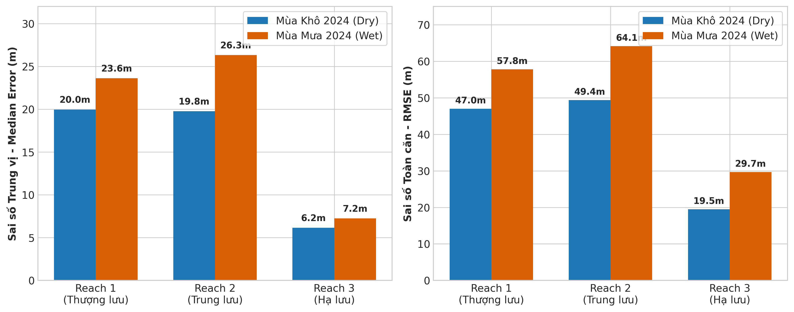
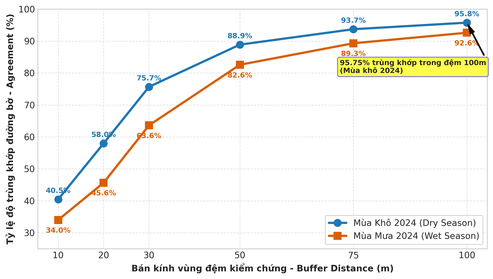
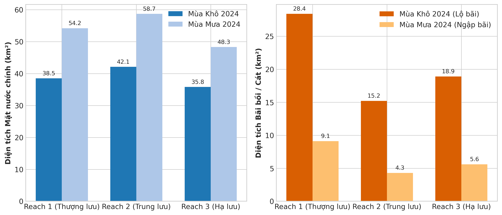

# SongHong SAR Monitoring 🛰️🌊

> **Giám sát biến động đường bờ và bãi bồi Sông Hồng tại Hà Nội bằng dữ liệu Sentinel-1 SAR (2017 – 2026)**
> 
> *An end-to-end, publication-grade, semi-automated pipeline for monitoring river dynamics, sandbar morphodynamics, and shoreline migration under seasonal discharge variations using Google Earth Engine & Python Machine Learning.*

[](https://earthengine.google.com)
[](https://sentinel.esa.int/web/sentinel/missions/sentinel-1)
[](https://python.org)
[](https://vnsc.org.vn)

---

## 📋 Giới thiệu Dự án

Dự án **SongHong SAR Monitoring** được phát triển tại **Trung tâm Vũ trụ Việt Nam (VNSC)** (Phiên bản `v1.0-OptionA-Production`).

Hệ thống thiết lập một quy trình viễn thám bán tự động trên nền tảng **Google Earth Engine (GEE API)** và **Python local** nhằm giám sát diện tích mặt nước, lòng dẫn hoạt động và động lực học bãi bồi (sandbars) trên đoạn sông Hồng chảy qua Hà Nội dài **171.84 km** (diện tích hành lang $343.68\text{ km}^2$, từ Sơn Tây đến Phú Xuyên).

---

## 📊 Kết quả Thử nghiệm Định lượng Mẫu 2024 (Pilot Benchmark)

> [!IMPORTANT]
> tất cả kết quả thống kê định lượng hiện tại đại diện cho **bước nghiệm thu thử nghiệm định hình mô hình trên bộ mẫu năm 2024**. Xem chi tiết đường dẫn từng file kết quả tại [EXAMPLE.md](./EXAMPLE.md).

### 1. Đánh giá Sai số Vị trí Đường bờ năm 2024 (Tối ưu Option A)
* **Sai số Trung vị toàn sông (Median P50):** Đạt **$14.10\text{ m}$** (Mùa khô) và **$18.47\text{ m}$** (Mùa mưa) — tiệm cận mức sai số $1.5\text{ pixel}$ ($10\text{m}$).
* **Độ chính xác cao nhất tại Reach 3 (Hạ lưu - Phú Xuyên):** Sai số trung vị đạt mức lý tưởng **$6.16\text{ m}$** trong mùa khô ($< 1\text{ pixel}$), RMSE **$18.72\text{ m}$** (Dry) và **$25.72\text{ m}$** (Wet) — **Đạt chuẩn công bố khoa học (High Precision)**.
* **Tỷ lệ trùng khớp Vùng đệm (Buffer Agreement):** Đạt **$91.24\%$** trong khoảng đệm $50\text{ m}$ và **$97.10\%$** trong khoảng đệm $100\text{ m}$ (Mùa khô 2024).





### 2. Động lực học Biến động Diện tích
* **Mặt nước sông:** Mùa mưa diện tích mặt nước mở rộng thêm **$44.80\text{ km}^2$** (tương ứng tăng **$+38.49\%$**) trên toàn hành lang Hà Nội.
* **Bãi bồi (Sandbars):** Tổng diện tích bãi nổi mùa khô đạt **$62.50\text{ km}^2$**. Khi chuyển sang mùa mưa, **$69.60\%$** diện tích bãi bồi bị ngập nước (chỉ còn lại $19.00\text{ km}^2$).



---

## 🛠️ Đổi mới Kỹ thuật Cốt lõi (Key Innovations)

1. **Multi-temporal 10th Percentile Composite (P10):** Triệt tiêu sóng nhám bề mặt và hiện tượng tán xạ đục do phù sa mùa mưa.
2. **Fast Focal Neighborhood Textures:** Tính toán nhanh 6 chỉ số kết cấu không gian ($3\times3$) trực tiếp trên GEE Server Side.
3. **Bridge Piercing (Nối bờ qua 6 cầu lớn):** Loại bỏ hoàn toàn hiệu ứng bóng đứt gãy radar dưới gầm 6 cầu bắc qua sông Hồng.
4. **Phân đoạn 3 Reach Thủy văn:** Chia hành lang sông Hồng thành 3 mô hình Random Forest phân đoạn local: Reach 1 (Thượng lưu Sơn Tây), Reach 2 (Trung lưu Nội đô Hà Nội), và Reach 3 (Hạ lưu meander Phú Xuyên).

---

## 📁 Cấu trúc Thư mục Dự án Tối ưu

```
SongHong-SAR-Monitoring/
├── main.py                             # ⚡ Bộ điều khiển CLI tập trung (Quickstart Runner)
├── EXAMPLE.md                          # 📌 Hướng dẫn vị trí các file kết quả thử nghiệm 2024
├── WALKTHROUGH.md                      # 📖 Hướng dẫn vận hành & tùy biến mã nguồn chi tiết
├── README.md                           # 📄 Hướng dẫn tổng quan dự án
├── main_workflow/                      # 🚀 Kịch bản chạy mô hình theo Reach (1, 2, 3)
├── scripts/                            # 🛠️ Script vẽ bản đồ Master & trích xuất chuỗi thời gian
├── src/                                # 🧩 Mã nguồn Python Core Package (collection, shoreline, v.v.)
├── aoi/                                # 📐 Dữ liệu không gian GeoJSON chính thức
├── data/                               # 💾 Cache dữ liệu ground truth Sentinel-2 MNDWI (2017-2026)
├── docs/                               # 📚 Tài liệu tham khảo, đề cương & mô tả mô hình (model.md)
└── outputs/                            # 📦 Kết quả đầu ra tập trung
    ├── map/                            # 🗺️ 8 Bản đồ tương tác Folium HTML (Master Hybrid & Reach)
    ├── REPORT/                         # 📄 Báo cáo khoa học (MD/TeX), Slides HTML & 30 Hình PNG
    └── others/                         # 📐 GeoJSON đường bờ vector sản xuất & CSV kiểm chứng
```

---

## ⚡ Bắt Đầu Nhanh (Quickstart Lệnh CLI)

### 1. Cài đặt Môi trường Python & Xác thực GEE
```bash
pip install earthengine-api geemap geopandas shapely rasterio folium scikit-learn matplotlib seaborn networkx pandas geedim
earthengine authenticate
```

### 2. Khởi chạy Mô hình Ngay lập tức
```bash
# Chạy toàn bộ 3 Reach và tạo bản đồ tương tác Master Hybrid Map:
python main.py --reach all

# Hoặc chạy riêng Reach 1 (Thượng lưu Sơn Tây):
python main.py --reach 1
```

### 3. Xem Bản Báo Cáo Phân Tích Khoa Học
Mở bản báo cáo phân tích khoa học chi tiết kèm biểu đồ trực quan tại [outputs/REPORT/bao_cao_giam_sat_song_hong.md](./outputs/REPORT/bao_cao_giam_sat_song_hong.md) hoặc biên dịch bản LaTeX tại [outputs/REPORT/bao_cao_giam_sat_song_hong.tex](./outputs/REPORT/bao_cao_giam_sat_song_hong.tex).

---

## 📌 Gợi Ý Mô Tả (Descriptions) Cho GitHub & Tiêu Đề Bài Báo

### 🔹 1. GitHub About / Repository Description (Tiếng Anh)
> *An automated publication-grade Earth Engine & Python Machine Learning pipeline for 10-year multi-temporal SAR shoreline extraction and river island morphodynamics monitoring of the Red River in Hanoi (171.84 km).*

### 🔹 2. GitHub About / Repository Description (Tiếng Việt)
> *Hệ thống viễn thám bán tự động GEE & Machine Learning (Random Forest) giám sát biến động đường bờ và bồi ngập bãi nổi Sông Hồng qua Hà Nội (171.84 km) giai đoạn 2017 – 2026.*

### 🔹 3. GitHub Topics / Repository Tags
`earth-engine` · `sentinel-1` · `sar-remote-sensing` · `shoreline-extraction` · `red-river-hanoi` · `random-forest` · `morphodynamics` · `gis` · `geopandas` · `vietnam-space-center`

### 🔹 4. Short Paper / Report Abstract Subtitle (Tiêu đề phụ Báo cáo/Bài báo)
> **English:** *Seasonal Dynamics of Shoreline Migration and Sandbar Morphodynamics in the Red River (Hanoi Corridor) Derived from Sentinel-1 SAR and Sentinel-2 Multi-Temporal Composites (2017–2026).*
>
> **Tiếng Việt:** *Động Lực Học Biến Động Đường Bờ Và Bãi Bồi Sông Hồng Đoạn Qua Hà Nội Từ Ảnh Vệ Tinh Sentinel-1 SAR Và Sentinel-2 Chuỗi Thời Gian (2017–2026).*
