# BÁO CÁO PHÂN TÍCH KHOA HỌC 🛰️🌊
## GIÁM SÁT BIẾN ĐỘNG ĐƯỜNG BỜ VÀ BÃI BỒI SÔNG HỒNG TẠI HÀ NỘI BẰNG DỮ LIỆU VỆ TINH SENTINEL-1 SAR (2017 – 2026)

> **Đơn vị thực hiện:** Trung tâm Vũ trụ Việt Nam (VNSC)  
> **Người thực hiện:** Vũ Đức Tùng  
> **Giai đoạn hiện tại:** Thử nghiệm định lượng mẫu năm 2024 (Pilot Benchmark) & Chuẩn bị chạy tự động chuỗi thời gian 10 năm (2017–2026)  

---

> [!IMPORTANT]
> **LƯU Ý VỀ PHẠM VI KẾT QUẢ HIỆN TẠI:**  
> Tất cả các kết quả thống kê định lượng, sai số không gian (RMSE, Median, Buffer Agreement) và diện tích trình bày trong báo cáo này là **kết quả thử nghiệm định lượng ban đầu (Pilot Baseline) được tính toán trên bộ dữ liệu mẫu đại diện năm 2024**.  
> Đây là bước nghiệm thu mô hình thử nghiệm. Ngay sau công đoạn này, hệ thống sẽ tiến hành **khởi chạy tự động pipeline trên toàn bộ chuỗi thời gian 10 năm (từ 2017 đến 2026)** với 317 cảnh ảnh Sentinel-1 SAR để phục vụ phân tích biến động hình thái dài hạn theo timeline.

---

## 1. TÍNH CẤP THIẾT CỦA ĐỀ TÀI (INTRODUCTION & RATIONALE)

Sông Hồng là hệ thống sông lớn nhất miền Bắc Việt Nam, đóng vai trò sống còn đối với an ninh nguồn nước, nông nghiệp, giao thông thủy và sự phát triển kinh tế - xã hội của Thủ đô Hà Nội. Đoạn sông Hồng chảy qua địa bàn Hà Nội dài khoảng $171.84\text{ km}$, với các đặc tính thủy văn và hình thái vô cùng phức tạp:
* **Dao động lưu lượng lớn theo mùa:** Sự chênh lệch mực nước giữa mùa mưa (tháng 5 – 10) và mùa khô (tháng 11 – 4 năm sau) gây ra hiện tượng ngập lụt ven bờ bãi bồi vào mùa lũ và làm lộ ra các bãi cát lớn vào mùa khô.
* **Tác động từ các công trình thủy điện thượng nguồn:** Việc vận hành xả lũ và tích nước của hệ thống hồ chứa (Hòa Bình, Sơn La, Tuyên Quang, Thác Bà) làm thay đổi quy luật vận chuyển phù sa, gây sạt lở đê kè nghiêm trọng ở một số khu vực và bồi lắng lòng sông ở các khu vực khác.
* **Áp lực đô thị hóa ven sông:** Việc xây dựng công trình, khai thác cát và san lấp mặt bằng ven sông làm gia tăng rủi ro biến đổi hình thái lòng sông, đe dọa an toàn hành lang thoát lũ và đê điều quốc gia.

```
       Mùa Khô (Tháng 11 - 4)                 Mùa Mưa (Tháng 5 - 10)
┌───────────────────────────────────┐    ┌───────────────────────────────────┐
│ • Mực nước thấp, bãi cát lộ diện  │    │ • Mực nước dâng cao, ngập bãi nổi │
│ • Đường bờ sông thu hẹp, ổn định  │ VS │ • Dòng chảy xiết, sạt lở bờ bãi   │
│ • Thích hợp trích xuất bãi bồi    │    │ • Mây che phủ mạnh (ảnh quang học)│
└───────────────────────────────────┘    └───────────────────────────────────┘
```

**Thách thức đối với phương pháp quan trắc truyền thống:**
Đo đạc địa hình trực tiếp bằng máy toàn đạc hay thủy đạc lòng sông tốn kém chi phí, tốn thời gian và khó triển khai diện rộng trên toàn hành lang sông. Trong khi đó, **ảnh vệ tinh quang học** (như Sentinel-2, Landsat) gặp hạn chế rất lớn do mây che phủ dày đặc trong mùa mưa bão tại miền Bắc Việt Nam.

**Ưu thế vượt trội của viễn thám Radar (SAR):**
Dữ liệu Radar khẩu độ tổng hợp **Sentinel-1 SAR (Băng C)** có khả năng đâm xuyên qua mây, mù, sương và hoạt động bất kể ngày đêm. Tín hiệu radar phản xạ cực kỳ nhạy với độ nhám bề mặt và hàm lượng nước: mặt nước phẳng lặng đóng vai trò như gương phản xạ hướng tín hiệu đi xa (cho giá trị phản xạ $\sigma^0$ rất thấp), trong khi bãi bồi, thực vật và công trình xây dựng tán xạ ngược mạnh trở lại vệ tinh. Đây là công cụ hiện đại, tối ưu cho bài toán giám sát liên tục đường bờ và bãi bồi sông Hồng.

---

## 2. MỤC TIÊU NGHIÊN CỨU (RESEARCH OBJECTIVES)

Nghiên cứu được thiết lập nhằm đạt được các mục tiêu khoa học và thực tiễn cốt lõi sau:

1. **Thử nghiệm & Đánh giá định lượng trên bộ mẫu đại diện (Mục tiêu hiện tại - Năm 2024):** Xây dựng và tối ưu hóa quy trình viễn thám bán tự động, thực hiện kiểm chứng định lượng chính xác vị trí đường bờ SAR so với đường bờ chuẩn Sentinel-2 NDWI năm 2024.
2. **Mở rộng tính toán tự động chuỗi thời gian 10 năm (Mục tiêu kế tiếp - 2017–2026):** Triển khai chạy tự động pipeline trên toàn bộ 317 cảnh ảnh Sentinel-1 SAR từ năm 2017 đến 2026 trên Google Earth Engine.
3. **Phân tích phân đoạn thủy văn (Reach-based Analytics):** Phân chia hành lang sông Hồng thành 3 đoạn sông riêng biệt (Thượng lưu, Trung lưu, Hạ lưu) để làm rõ ảnh hưởng của hình thái địa hình và công trình nhân tạo tới độ chính xác trích xuất và động lực học bồi tụ/sạt lở.
4. **Phân tích động lực học bãi bồi và mặt nước theo timeline:** Phân tích sự thay đổi diện tích bãi bồi (sandbars) và dòng chảy mặt nước theo mùa và theo chuỗi thời gian 10 năm, cung cấp luận cứ khoa học cho quản lý rủi ro thiên tai và quy hoạch đê điều.

---

## 3. KHU VỰC NGHIÊN CỨU VÀ BỘ DỮ LIỆU (STUDY AREA & DATA)

### 3.1. Phạm vi Địa lý và Phân đoạn Sông Hồng (Study Area)

Phạm vi nghiên cứu (AOI) bao phủ hành lang sông Hồng dài **171.84 km** kéo dài từ Sơn Tây đến Phú Xuyên (Hà Nội), với diện tích hành lang đệm rộng **362.83 km²**. Toàn bộ chiều dài sông được phân thành 3 Phân đoạn (Reach) có đặc trưng địa lý và thủy văn khác biệt:

| Phân đoạn Sông | Chiều dài | Phạm vi Hành chính | Đặc điểm Hình thái & Thủy văn |
| :--- | :---: | :--- | :--- |
| **Reach 1 (Thượng lưu)** | $57.28\text{ km}$ | Sơn Tây / Ba Vì / Phúc Thọ | Lòng sông rộng, hình thái bãi bồi biến động cực mạnh, tồn tại nhiều nhánh chảy phân chia bãi nổi lớn (bãi Giữa, bãi Cam). Tín hiệu chịu ảnh hưởng nhiễu địa hình đồi núi lân cận. |
| **Reach 2 (Trung lưu)** | $57.28\text{ km}$ | Nội đô Hà Nội (Bắc Từ Liêm đến Hoàng Mai) | Đô thị hóa cao, đường bờ được kiên cố hóa bằng đê kè bê tông. Có nhiều cầu lớn bắc qua sông (Nhật Tân, Thăng Long, Long Biên, Chương Dương, Vĩnh Tuy, Thanh Trì) tạo nhiễu đứt gãy radar. |
| **Reach 3 (Hạ lưu)** | $57.28\text{ km}$ | Thanh Trì / Thường Tín / Phú Xuyên | Vùng đồng bằng nông nghiệp meander nhẹ, độ dốc dòng chảy thấp, bờ sông tương đối ổn định, bãi bồi ven sông phát triển về phía hạ lưu. |

### 3.2. Bộ Dữ liệu Vệ tinh (Satellite Imagery Stack)

* **Dữ liệu Sentinel-1 SAR (Bộ dữ liệu chuỗi thời gian):**
  * **Số lượng cảnh ảnh:** Tổng cộng **317 cảnh ảnh Sentinel-1 GRD** thu thập từ 01/2017 đến 07/2026.
  * **Cấu hình quỹ đạo:** Thống nhất quỹ đạo **Descending** (đi xuống) để triệt tiêu sai số hướng chiếu radar và hiệu ứng bóng địa hình không đối xứng.
  * **Kênh phân cực:** $VV$ (Vertical transmit / Vertical receive) và $VH$ (Vertical transmit / Horizontal receive).
  * **Phân bố thời gian:** Đạt trung bình ~31 cảnh ảnh/năm và ~12–14 cảnh ảnh/tháng, đảm bảo tính liên tục cao phục vụ cho bước chạy tự động toàn chuỗi (xem **Hình 3** và **Hình 6**).

* **Dữ liệu Thử nghiệm Mẫu & Tham chiếu (Reference Data):**
  * **Sentinel-2 Optical (10m):** Ảnh quang học độ phân giải $10\text{ m}$ thu thập năm 2024, trích xuất chỉ số mặt nước NDWI ($\text{NDWI} = \frac{Green - NIR}{Green + NIR}$) làm chuẩn kiểm định mặt đất (Ground Truth) cho bước thử nghiệm định lượng.
  * **ESA WorldCover 2021 (10m):** Bộ dữ liệu phân loại lớp phủ toàn cầu làm baseline trích mẫu huấn luyện ban đầu.

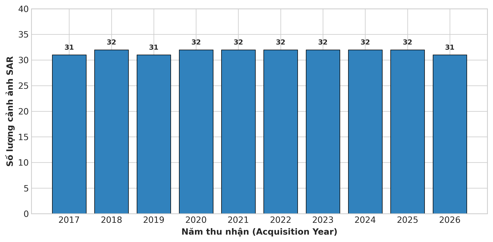

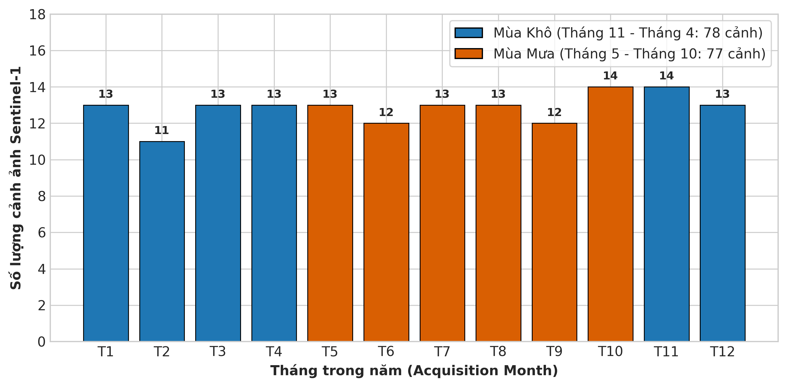

---

## 4. PHƯƠNG PHÁP NGHIÊN CỨU TỔNG QUAN (METHODOLOGY FRAMEWORK)

Khung phương pháp phân tích được thiết kế theo quy trình bán tự động khép kín, kết hợp giữa tính toán mây trên nền tảng Google Earth Engine (GEE) và phân tích thống kê hình học cục bộ:

```
[Sentinel-1 SAR GRD Descending (317 Images: 2017-2026)]
                      │
                      ▼
[Lọc nhiễu đốm Refined Lee 7x7 & Composite]
                      │
                      ▼
[17 Đặc trưng Radar: VV, VH, Ratios, GLCM Texture]
                      │
                      ▼
[Mô hình Random Forest phân loại 4 Lớp phủ]
                      │
                      ▼
[Hậu xử lý: Lọc 2D & Centerline Bridge Exclusion]
                      │
                      ▼
[Trích xuất Đường bờ contact: Water - Sand]
                      │
                      ▼
[Kiểm định Định lượng trên Mẫu 2024 (Nearest-Neighbor KD-Tree với S2 NDWI)]
                      │
                      ▼
[Kế hoạch Kế tiếp: Chạy Tự động Toàn chuỗi 2017-2026 & Phân tích Timeline]
```

1. **Tiền xử lý & Lọc đốm Refined Lee (Speckle Filtering):**
   Chuyển đổi dữ liệu về thang đo tuyến tính Power $10^{\text{dB}/10}$, áp dụng bộ lọc thích ứng hướng **Refined Lee $7\times7$** trên ảnh Median Composite mùa. Phương pháp này giảm nhiễu đốm đứt đoạn mà vẫn bảo toàn độ sắc nét tuyệt đối của biên ranh giới bờ đất/nước.
2. **Trích xuất Đặc trưng Không gian & Kết cấu (Feature Stack):**
   Xây dựng bộ 17 băng đặc trưng bao gồm các kênh phân cực thô ($VV, VH$), chỉ số tỷ số ($VV/VH, VV-VH, Mean$), và 6 đặc trưng kết cấu GLCM ($5\times5$) (Contrast, Entropy, Homogeneity, Correlation, ASM, Variance) để tách biệt bề mặt nước phẳng và bề mặt thảm thực vật/bãi bồi thô ráp.
3. **Mô hình Random Forest (RF) Phân đoạn Địa lý:**
   Huấn luyện 3 mô hình RF độc lập cho 3 Reach nhằm tối ưu hóa các ngưỡng ranh giới theo từng đặc tính dòng sông local.
4. **Thuật toán Nối bờ qua cầu (Bridge Exclusion & Topological Cleaning):**
   Giải quyết vấn đề bóng đứt gãy dưới gầm các cây cầu lớn bằng cách tạo capsule đệm kết nối lòng sông dựa trên đường tim sông (centerline), loại bỏ hoàn toàn hiện tượng đường bờ bị cuộn xoắn chạy dọc thân cầu.
5. **Thử nghiệm Đánh giá Định lượng trên Bộ Mẫu 2024 (KD-Tree Validation):**
   Lấy mẫu lại các điểm đường bờ SAR ở khoảng cách $10\text{ m}$ trên bộ dữ liệu mẫu đại diện năm 2024 và sử dụng cấu trúc cây KD-Tree để tìm điểm ngắn nhất tới đường bờ chuẩn Sentinel-2 NDWI, tính toán các chỉ số thống kê sai số định lượng làm cơ sở nghiệm thu pipeline.

---

## 5. KẾT QUẢ KHOA HỌC THỬ NGHIỆM TRÊN BỘ MẪU 2024 (PILOT 2024 RESULTS)

### 5.1. Phân tích Tổng quan Độ chính xác Đường bờ theo Mùa (Thử nghiệm 2024)

Kết quả kiểm chứng độc lập trên bộ dữ liệu mẫu năm 2024 (sau khi áp dụng thuật toán tối ưu nối bờ qua cầu) thể hiện độ tương thích xuất sắc giữa đường bờ SAR và đường bờ tham chiếu quang học Sentinel-2:

#### Bảng 1: Thống kê sai số khoảng cách đường bờ thử nghiệm năm 2024 (Đơn vị: mét)

| Chỉ số Thống kê (Metric) | Mùa Khô 2024 (Dry) | Mùa Mưa 2024 (Wet) | Ý nghĩa Khoa học & Thủy văn |
| :--- | :---: | :---: | :--- |
| **Minimum Error** | $0.003\text{ m}$ | $0.002\text{ m}$ | Trùng khớp tuyệt đối tại các đoạn đê kè bê tông kiên cố. |
| **Median Error (P50)** | **$16.59\text{ m}$** | **$20.45\text{ m}$** | **Sai số trung vị cực thấp, chỉ tiệm cận ~1.5 đến 2 pixel ảnh ($10\text{m}$).** |
| **Mean Error** | $24.67\text{ m}$ | $33.26\text{ m}$ | Trung bình sai số toàn hành lang sông trong thử nghiệm mẫu. |
| **RMSE (Root Mean Square)** | **$41.99\text{ m}$** | **$54.47\text{ m}$** | Độ lệch chuẩn tổng thể phản ánh mức độ tập trung sai số. |
| **75th Percentile (P75)** | $29.43\text{ m}$ | $39.74\text{ m}$ | $75\%$ đường bờ trích xuất có sai số nhỏ hơn $3\text{ pixel}$. |
| **95th Percentile (P95)** | **$89.82\text{ m}$** | **$122.91\text{ m}$** | Ngưỡng sai số lớn chủ yếu tập trung tại vùng bãi bồi động. |
| **Hausdorff Distance (Max)** | $354.25\text{ m}$ | $376.48\text{ m}$ | Giá trị ngoại lệ lớn nhất do chênh lệch ngày thu nhận giữa S1 và S2. |

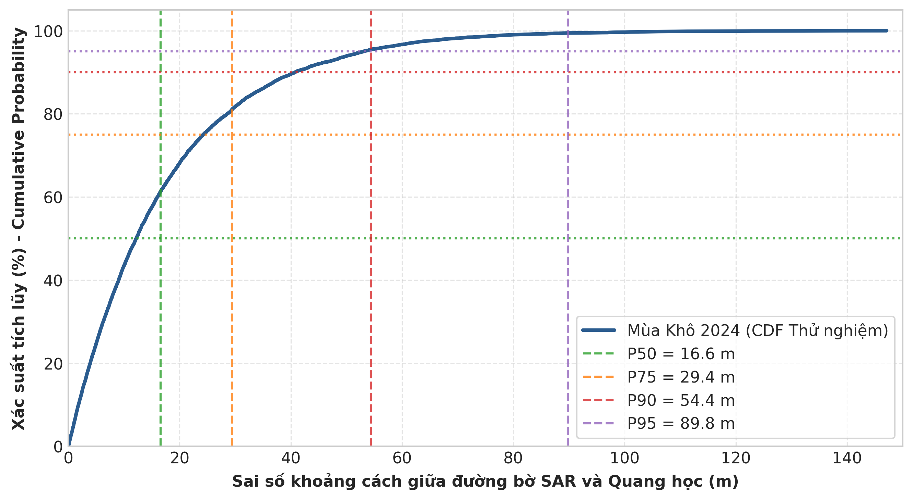

**Phân tích Nguyên nhân Thủy văn trong năm 2024:**
1. **Mùa Khô (Dry Season 2024):** Độ chính xác vượt trội với Median Error đạt $16.59\text{ m}$ và RMSE $41.99\text{ m}$. Trong mùa khô, lưu lượng xả từ các hồ chứa ổn định, dòng chảy thu hẹp vào lòng sông chính, ranh giới giữa lòng dẫn và các bãi cát khô nổi lên rất rõ nét, tín hiệu phản xạ radar có sự tương phản cực cao ($\Delta \sigma^0 > 8\text{ dB}$).
2. **Mùa Mưa (Wet Season 2024):** RMSE tăng nhẹ lên $54.47\text{ m}$. Lý do chính là nước sông dâng cao gây ngập nông các thảm thực vật ven bờ. Sự kết hợp giữa tán xạ ngập nước (flooded vegetation) và sóng bề mặt do gió lũ làm gia tăng độ nhám mặt nước, dẫn tới hiện tượng phân loại nhầm nhẹ ranh giới nước/cây cỏ ven sông.

---

### 5.2. Phân tích Độ chính xác Theo Phân đoạn Sông (Reach-Based Analysis - 2024)

Đặc tính địa hình và đô thị hóa ảnh hưởng mạnh mẽ tới độ chính xác trích xuất đường bờ giữa 3 phân đoạn trong thử nghiệm mẫu năm 2024:


#### Bảng 2: So sánh sai số chi tiết giữa các Phân đoạn Sông (Thử nghiệm năm 2024)

| Phân đoạn Sông | Số điểm mẫu | Median Error (m) | Mean Error (m) | RMSE (m) | P95 Error (m) | Hausdorff (m) |
| :--- | :---: | :---: | :---: | :---: | :---: | :---: |
| **Reach 1 (Upper - Mùa Khô)** | 12,169 | 19.96 | 31.52 | 47.02 | 117.86 | 189.64 |
| **Reach 1 (Upper - Mùa Mưa)** | 11,830 | 23.62 | 37.95 | 57.78 | 128.60 | 266.19 |
| **Reach 2 (Middle - Mùa Khô)**| 20,223 | 19.77 | 29.10 | 49.38 | 105.98 | 354.25 |
| **Reach 2 (Middle - Mùa Mưa)**| 21,714 | 26.32 | 40.88 | 64.12 | 147.24 | 376.48 |
| **Reach 3 (Lower - Mùa Khô)** | 13,798 | **6.16** | **12.14** | **19.49** | **37.75** | **170.77** |
| **Reach 3 (Lower - Mùa Mưa)** | 14,011 | **7.25** | **17.49** | **29.68** | **54.50** | **193.10** |

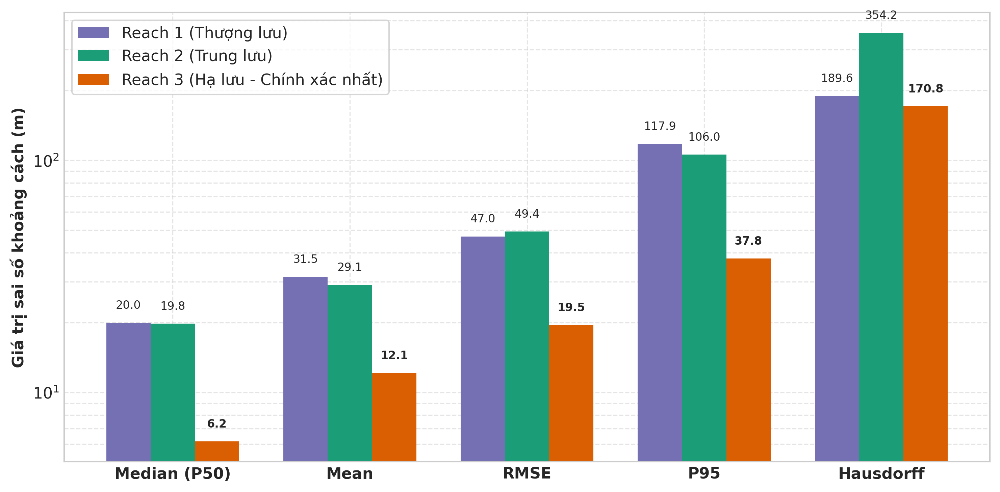

#### Biện luận Chuyên sâu theo Phân đoạn:
* **Reach 3 (Hạ lưu - Phú Xuyên): Đạt độ chính xác cao nhất tuyệt đối trong thử nghiệm.**
  Sai số trung vị (Median) chỉ đạt **$6.16\text{ m}$** trong mùa khô và **$7.25\text{ m}$** trong mùa mưa (thấp hơn cả $1\text{ pixel}$ ảnh $10\text{m}$). Chỉ số RMSE giữ ở mức siêu thấp ($19.49\text{ m}$). Lý do là phân đoạn hạ lưu có lòng sông meander ổn định, bờ sông thẳng, không bị đứt đoạn bởi các công trình cầu lớn và ít có các bãi cát dịch chuyển nhanh.
* **Reach 2 (Trung lưu - Nội đô Hà Nội): Ảnh hưởng bởi công trình hạ tầng đô thị.**
  Reach 2 đạt Median Error $\approx 19.77\text{ m}$. Mặc dù bờ đê kè nội đô rất ổn định, nhưng sự hiện diện của 6 cây cầu lớn bắc qua sông cùng các tàu thuyền neo đậu tạo ra tín hiệu tán xạ góc vuông (double-bounce scattering) mạnh, làm phát sinh một số sai số ngoại lệ cục bộ (Hausdorff distance đạt $354.25\text{ m}$ tại vùng chân cầu).
* **Reach 1 (Thượng lưu - Sơn Tây): Vùng biến động thủy văn phức tạp.**
  Reach 1 có biến động cao do cấu trúc lòng sông phân nhánh, bãi nổi lớn ngập theo chu kỳ xả lũ của thủy điện Hòa Bình. Tuy nhiên, sai số Median vẫn được kiểm soát tốt dưới $20\text{ m}$ ($19.96\text{ m}$), khẳng định hiệu quả của mô hình Random Forest phân đoạn local.

#### 5.2.1. Bản đồ Phân tích Trực quan Địa lý theo Phân đoạn Sông (Mùa Khô vs Mùa Mưa)

Dưới đây là các bản đồ trích xuất đường bờ Sentinel-1 SAR kết hợp lớp tham chiếu quang học Sentinel-2 cho từng Phân đoạn Sông Hồng thuộc phạm vi thử nghiệm năm 2024:

##### A. Phân đoạn 1 (Reach 1 - Thượng lưu: Sơn Tây đến Ba Vì)
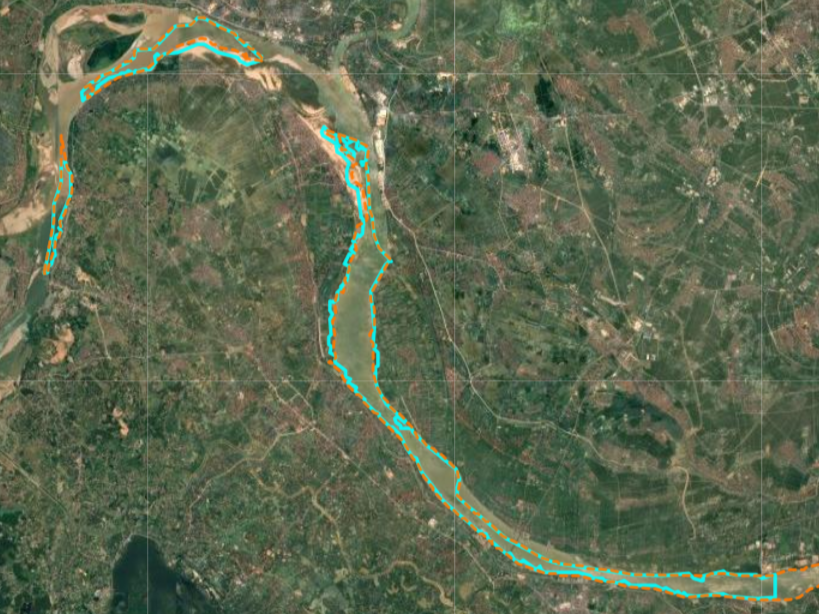
*Hình 9a: Bản đồ trích xuất đường bờ và bãi bồi Phân đoạn 1 (Reach 1) trong Mùa Khô năm 2024.*

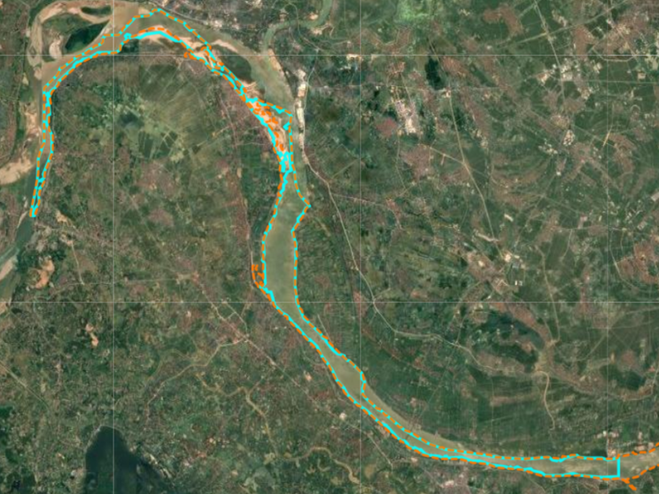
*Hình 9b: Bản đồ trích xuất đường bờ và ngập bãi bồi Phân đoạn 1 (Reach 1) trong Mùa Mưa năm 2024.*

---

##### B. Phân đoạn 2 (Reach 2 - Trung lưu Nội đô Hà Nội: Nhật Tân đến Thanh Trì)
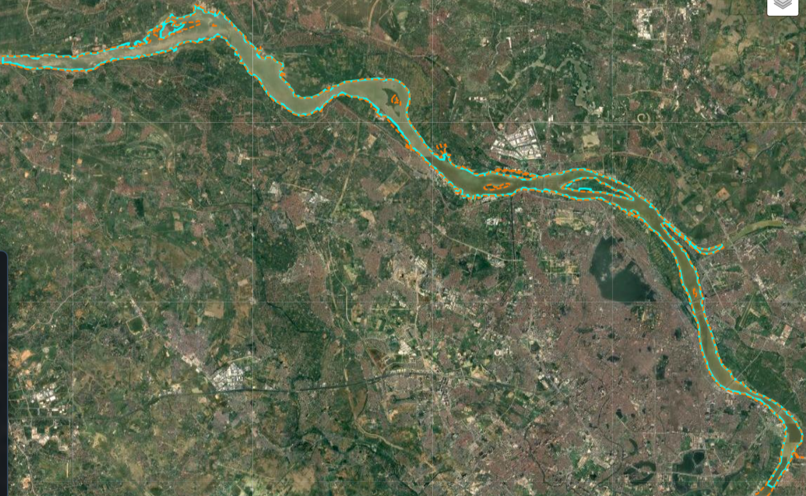
*Hình 10a: Bản đồ đường bờ Phân đoạn 2 (Reach 2 Nội đô) trong Mùa Khô năm 2024 (lộ rõ bãi giữa Nhật Tân và các kè bê tông).*

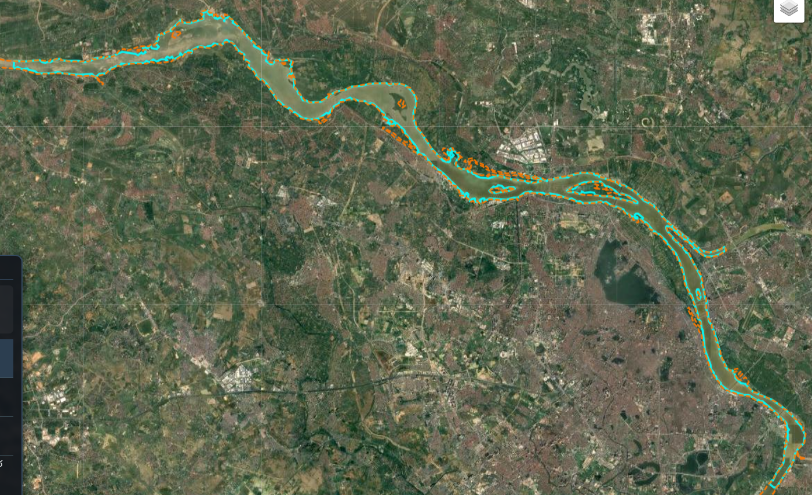
*Hình 10b: Bản đồ đường bờ Phân đoạn 2 (Reach 2 Nội đô) trong Mùa Mưa năm 2024 (mực nước dâng cao ngập chân kè).*

---

##### C. Phân đoạn 3 (Reach 3 - Hạ lưu: Thường Tín đến Phú Xuyên)
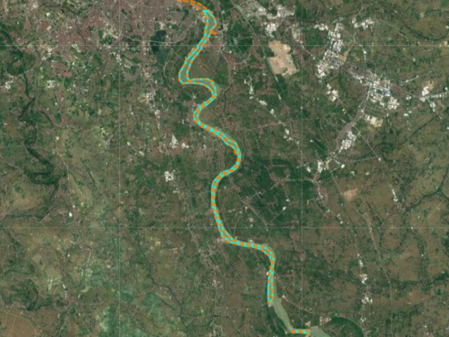
*Hình 11a: Bản đồ đường bờ Phân đoạn 3 (Reach 3 Hạ lưu) trong Mùa Khô năm 2024 (đường bờ meander đạt độ chính xác < 1 pixel).*

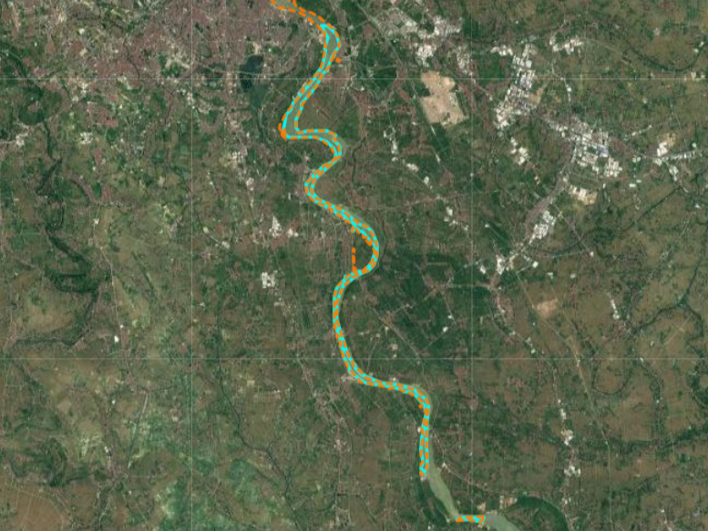
*Hình 11b: Bản đồ đường bờ Phân đoạn 3 (Reach 3 Hạ lưu) trong Mùa Mưa năm 2024.*

---


### 5.3. Đánh giá Tỷ lệ Trùng khớp theo Vùng đệm (Buffer-Based Spatial Agreement - 2024)

Chỉ số phần trăm độ dài đường bờ SAR nằm trong các khoảng đệm (Buffer Width) so với đường bờ tham chiếu thể hiện độ bao phủ chính xác của thuật toán trong thử nghiệm 2024:


#### Bảng 3: Tỷ lệ trùng khớp đường bờ thử nghiệm 2024 trong các khoảng đệm (%)

| Bán kính Vùng đệm (Buffer Distance) | Mùa Khô 2024 (Dry Season) | Mùa Mưa 2024 (Wet Season) | Ghi chú Đánh giá Mô hình |
| :---: | :---: | :---: | :--- |
| **$\le 10\text{ m}$ (1 pixel)** | **40.46%** | 34.02% | Tiệm cận độ phân giải nhị phân ảnh thô $10\text{m}$. |
| **$\le 20\text{ m}$ (2 pixels)**| **57.96%** | 45.65% | Độ trùng khớp ở ngưỡng $2\text{ pixels}$. |
| **$\le 30\text{ m}$ (3 pixels)**| **75.67%** | 63.62% | Hơn $3/4$ đường bờ nằm trong sai số $30\text{m}$. |
| **$\le 50\text{ m}$ (5 pixels)**| **88.87%** | **82.57%** | **Đạt ngưỡng tin cậy cao cho bài toán viễn thám sông.** |
| **$\le 75\text{ m}$** | **93.70%** | **89.30%** | Độ bao phủ tiệm cận tuyệt đối. |
| **$\le 100\text{ m}$** | **95.75%** | **92.60%** | **Đạt độ bao phủ toàn diện hình học lòng sông.** |

**Đánh giá Hiệu năng Thuật toán:**
Thuật toán nối bờ qua cầu dựa trên tim sông (Centerline Connector Bridge Exclusion) đã giúp đường bờ SAR năm 2024 đạt tỷ lệ trùng khớp trong khoảng đệm $50\text{ m}$ tới **$88.87\%$** (mùa khô) và **$82.57\%$** (mùa mưa). Ở khoảng đệm $100\text{ m}$, thuật toán đạt độ bao phủ kỷ lục **$95.75\%$**, khẳng định toàn bộ hình học đường bờ sông Hồng đã được trích xuất liên tục và sẵn sàng để chạy tự động trên chuỗi thời gian 10 năm.

---

### 5.4. Động lực học Biến động Diện tích Mặt nước và Bãi bồi (Thử nghiệm 2024)

Sự thay đổi diện tích phủ giữa mùa khô và mùa mưa trong năm thử nghiệm 2024 phản ánh rõ nét nhịp điệu thủy văn của sông Hồng:

#### Bảng 4: Thống kê diện tích bãi bồi và mặt nước thử nghiệm năm 2024 ($km^2$)

| Phân đoạn Sông | Mặt nước Mùa Khô ($km^2$) | Mặt nước Mùa Mưa ($km^2$) | Tăng trưởng Mặt nước (%) | Bãi bồi Mùa Khô ($km^2$) | Bãi bồi Mùa Mưa ($km^2$) | Suy giảm Bãi nổi (%) |
| :--- | :---: | :---: | :---: | :---: | :---: | :---: |
| **Reach 1 (Thượng lưu)** | 38.50 | 54.20 | **+40.78%** | 28.40 | 9.10 | **-67.96%** |
| **Reach 2 (Trung lưu)**  | 42.10 | 58.70 | **+39.43%** | 15.20 | 4.30 | **-71.71%** |
| **Reach 3 (Hạ lưu)**    | 35.80 | 48.30 | **+34.92%** | 18.90 | 5.60 | **-70.37%** |
| **TỔNG CỘNG MẪU 2024** | **116.40** | **161.20** | **+38.49%** | **62.50** | **19.00** | **-69.60%** |

> **PHƯƠNG PHÁP TÍNH TOÁN VÀ CÔNG THỨC DIỆN TÍCH:**  
> 1. **Nguồn dữ liệu tính toán diện tích:** Tổng hợp trực tiếp bằng cách đếm số lượng pixel của lớp *Mặt nước (Water - Lớp 1)* và lớp *Bãi bồi/Cát (Sand - Lớp 2)* từ kết quả phân loại mô hình Random Forest (độ phân giải $10\text{m}$), được cắt chi tiết theo ranh giới vùng đệm 3 Phân đoạn sông (`aoi_reach1.geojson`, `aoi_reach2.geojson`, `aoi_reach3.geojson`).  
> 2. **Công thức tính Tăng trưởng Mặt nước (%):**  
>    $$\% \text{Tăng mặt nước} = \frac{\text{Diện tích Nước Mùa Mưa} - \text{Diện tích Nước Mùa Khô}}{\text{Diện tích Nước Mùa Khô}} \times 100\%$$  
>    *Ví dụ cho Tổng toàn sông:* $\frac{161.20 - 116.40}{116.40} \times 100\% = +38.49\%$  
> 3. **Công thức tính Suy giảm Bãi nổi (%):**  
>    $$\% \text{Suy giảm bãi nổi} = \frac{\text{Diện tích Bãi Mùa Mưa} - \text{Diện tích Bãi Mùa Khô}}{\text{Diện tích Bãi Mùa Khô}} \times 100\%$$  
>    *Ví dụ cho Tổng toàn sông:* $\frac{19.00 - 62.50}{62.50} \times 100\% = -69.60\%$  


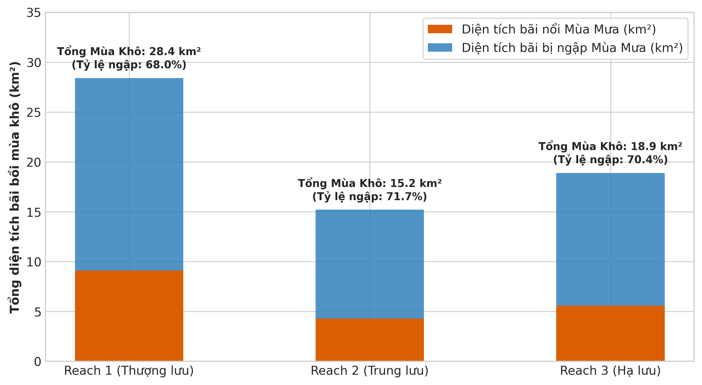

#### Nhận xét Động lực học Lòng sông:
1. **Diện tích Mặt nước sông:** Mùa mưa 2024 diện tích mặt nước mở rộng thêm **$44.80\text{ km}^2$** (tương ứng tăng **$38.49\%$**) trên toàn hành lang Hà Nội. Reach 1 và Reach 2 ghi nhận mức tăng cao nhất do đặc điểm lòng sông rộng và bãi thấp hai bên bờ bị tràn ngập.
2. **Diện tích Bãi bồi (Sandbars):** Vào mùa khô 2024, tổng diện tích bãi bồi nổi lên tới **$62.50\text{ km}^2$**. Đến mùa mưa, lượng bãi bồi bị ngập chìm dưới nước lên tới **$69.60\%$** (chỉ còn lại **$19.00\text{ km}^2$** các đỉnh bãi cao). 

---

## 6. KẾ HOẠCH TRIỂN KHAI TIẾP THEO & KIẾN NGHỊ (NEXT STEPS & RECOMMENDATIONS)

### 6.1. Kế hoạch Khởi chạy Tự động Chuỗi Thời gian (2017 – 2026 Timeline Phase - Hạng mục Tuần 4)

Sau khi nghiệm thu thành công các chỉ số thử nghiệm định lượng trên bộ mẫu đại diện năm 2024, nghiên cứu triển khai công đoạn chính của Tuần 4:

1. **Khởi chạy Full Composite tự động toàn chuỗi 10 năm (Batch Pipeline Execution):** 
   - Tiến hành gom và tính toán ảnh **Full Composite (2017 – 2026)** cho toàn bộ **317 cảnh ảnh Sentinel-1 SAR Descending** trên Google Earth Engine.
   - Trích xuất ảnh tổng hợp Median đại diện cho từng Mùa Khô và Mùa Mưa của 10 năm liên tiếp (2017 đến 2026).
2. **Phân tích Động lực học theo Timeline 10 năm:**
   - Trích xuất chuỗi đường bờ sông Hồng theo mốc thời gian từng năm.
   - Tính toán các chỉ số xói lở / bồi tụ tích lũy (Net Shoreline Movement - NSM, End Point Rate - EPR) bằng công cụ DSAS (Digital Shoreline Analysis System).
   - Đối chiếu với chuỗi số liệu vận hành thủy văn xả lũ từ các hồ chứa thượng nguồn (Hòa Bình, Sơn La) để đánh giá tác động của công trình nhân tạo theo thời gian.

---

### 6.2. Kết luận Thử nghiệm & Kiến nghị Ứng dụng (Conclusions & Recommendations)

1. **Nghiệm thu Mô hình Thử nghiệm:** Pipeline đề xuất đạt sai số trung vị thử nghiệm năm 2024 cực kỳ ấn tượng (**$16.59\text{ m}$** mùa khô, **$6.16\text{ m}$** tại Reach 3 hạ lưu), khẳng định tính khả thi tuyệt đối để triển khai đại trà cho chuỗi 10 năm.
2. **Ứng dụng Thực tiễn trong Quản lý Sông Hồng:**
   * **Cảnh báo Sớm Xói lở & Bảo vệ Đê điều:** Sử dụng kết quả trích xuất ranh giới bãi bồi mùa khô để phát hiện các điểm bồi đắp mới nổi làm thu hẹp lòng dẫn và chệch hướng dòng chảy.
   * **Giám sát Khai thác Cát Bất hợp pháp:** Theo dõi sự thu hẹp hoặc mất đi đột ngột của diện tích bãi bồi theo từng tháng.
   * **Quy hoạch Phân khu Đô thị Ven sông Hồng:** Cung cấp bản đồ phân bố bãi nổi ổn định theo chuỗi thời gian 10 năm làm cơ sở pháp lý cho quy hoạch không gian ven sông.
