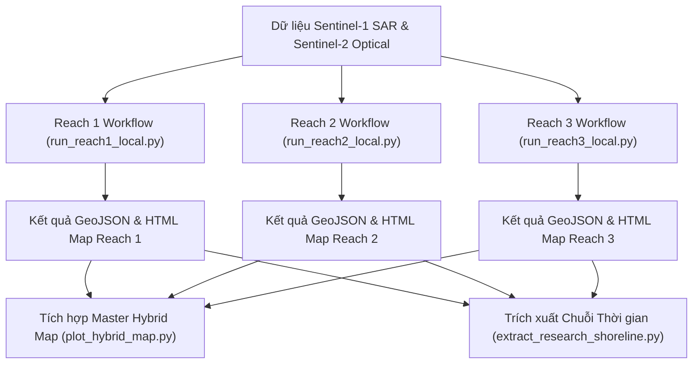

# 🚀 Hướng Dẫn Vận Hành Dự Án Giám Sát Đường Bờ Sông Hồng (SongHong-SAR-Monitoring)

> **SongHong SAR Monitoring** là hệ thống viễn thám bán tự động kết hợp **Google Earth Engine (GEE)** và **Python Local Machine Learning (Random Forest 17-band feature stack + Otsu dynamic calibration)** nhằm giám sát động lực học đường bờ và bãi bồi Sông Hồng qua Hà Nội (171.84 km) bằng dữ liệu Sentinel-1 SAR & Sentinel-2 Optical.

---

## 🛠️ 1. Yêu Cầu Môi Trường & Cài Đặt (Prerequisites & Setup)

### 1.1 Môi trường Python
* **Python Version:** Python 3.10 trở lên.
* **Các thư viện chính:**
  ```bash
  pip install earthengine-api geemap geopandas shapely rasterio folium scikit-learn matplotlib seaborn networkx pandas
  ```

### 1.2 Xác thực Google Earth Engine (GEE)
Dự án sử dụng GEE API để truy vấn ảnh Sentinel-1/Sentinel-2 và tính toán chỉ số địa hình (HAND/Slope). Bạn cần xác thực GEE trước khi chạy:
```bash
earthengine authenticate
```
> [!NOTE]
> Mã nguồn mặc định sử dụng GEE Project: `projects/songhong-sar-monitoring`. Bạn có thể thay đổi ID dự án trong file [src/config.py](file:///d:/Future%20Career/SongHong-SAR-Monitoring/src/config.py).

---

## 🏃 2. Các Bước Khởi Chạy Mô Hình Chi Tiết (Execution Workflow)

Hệ thống được thiết kế theo cấu trúc mô-đun hóa 3 Phân đoạn (Reach 1, Reach 2, Reach 3) tương ứng với 3 vùng đặc trưng thủy văn:



---

### Bước 1: Chạy Mô Hình Chi Tiết Theo Từng Reach

Bạn có thể chạy riêng từng phân đoạn sông Hồng để kiểm tra kết quả:

#### 🟢 1. Reach 1 (Thượng lưu - Sơn Tây / Ba Vì)
Tích hợp bộ lọc bóng núi (HAND & Slope) xử lý nhiễu địa hình Ba Vì.
```bash
python main_workflow/run_reach1_local.py
```
* **Đầu ra:**
  - `outputs/reach1_s1_shoreline_2024_dry.geojson`
  - `outputs/reach1_s1_shoreline_2024_wet.geojson`
  - 🗺️ `outputs/map/reach1_interactive_map_2024_dry.html`
  - 🗺️ `outputs/map/reach1_interactive_map_2024_wet.html`

#### 🟢 2. Reach 2 (Trung lưu Đô thị Hà Nội - Chân cầu & Cồn cát)
Tích hợp thuật toán **Bridge Piercing (Nối bờ qua cầu)** và **Island Buffer Overlay** lọc cồn cát ngập/nổi.
```bash
python main_workflow/run_reach2_local.py
```
* **Đầu ra:**
  - `outputs/reach2_s1_shoreline_2024_dry.geojson`
  - `outputs/reach2_s1_shoreline_2024_wet.geojson`
  - 🗺️ `outputs/map/reach2_interactive_map_2024_dry.html`
  - 🗺️ `outputs/map/reach2_interactive_map_2024_wet.html`

#### 🟢 3. Reach 3 (Hạ lưu - Đồng bằng Phú Xuyên)
Xử lý các khúc uốn meander nông và dòng chảy chứa hàm lượng phù sa cao.
```bash
python main_workflow/run_reach3_local.py
```
* **Đầu ra:**
  - `outputs/reach3_s1_shoreline_2024_dry.geojson`
  - `outputs/reach3_s1_shoreline_2024_wet.geojson`
  - 🗺️ `outputs/map/reach3_interactive_map_2024_dry.html`
  - 🗺️ `outputs/map/reach3_interactive_map_2024_wet.html`

---

### Bước 2: Tạo Bản Đồ Tương Tác Master Hybrid Toàn Tuyến (All 3 Reaches)

Sau khi hoàn tất xuất kết quả 3 Reach, chạy script tổng hợp để vẽ bản đồ tương tác ghép toàn bộ 171.84 km sông Hồng:

```bash
python scripts/plot_hybrid_map.py
```
* **Đầu ra Bản đồ Master:**
  - 🗺️ [outputs/map/hybrid_shoreline_map_2024_dry.html](file:///d:/Future%20Career/SongHong-SAR-Monitoring/outputs/map/hybrid_shoreline_map_2024_dry.html) (Mùa khô)
  - 🗺️ [outputs/map/hybrid_shoreline_map_2024_wet.html](file:///d:/Future%20Career/SongHong-SAR-Monitoring/outputs/map/hybrid_shoreline_map_2024_wet.html) (Mùa mưa)

---

### Bước 3: Trích Xuất Đường Bờ Chuỗi Thời Gian Nhiều Năm (2017 – 2026)

Để trích xuất tự động đường bờ phục vụ nghiên cứu biến động chuỗi thời gian nhiều năm:

```bash
python scripts/extract_research_shoreline.py
```

---

## 📊 3. Quy Chuẩn Bảng Đánh Giá Mức Độ Sai Số Vị Trí (Validation Rating Table)

Tất cả các bản đồ HTML tương tác xuất ra từ hệ thống đều tích hợp sẵn bảng phân cấp sai số vị trí theo đúng chuẩn khoa học viễn thám:

| Mức độ (Rating) | RMSE Distance | Quy đổi Số lượng Pixel (ảnh 10m) | Ý nghĩa Thực tiễn & Học thuật |
| :--- | :---: | :---: | :--- |
| 🟢 **Tốt (Good)** | $< 30\text{m}$ | $< 3\text{ pixels}$ | **Đạt chuẩn công bố khoa học (High Precision).** Bắt chính xác sự thay đổi của bãi bồi/đường bờ. |
| 🟡 **Trung bình (Moderate)** | $30\text{m} - 70\text{m}$ | $3 - 7\text{ pixels}$ | **Đạt chuẩn giám sát quy mô vùng (Regional Scale).** Nhận diện tốt xu hướng biến động tích tụ/sạt lở diện rộng. |
| 🔴 **Kém (Poor)** | $> 70\text{m}$ | $> 7\text{ pixels}$ | **Chưa đạt yêu cầu (High Error).** Sai số do nhiễu speckle radar, phù sa đục hoặc cầu/công trình nhân tạo. |

---

## 📁 4. Cấu Trúc Mã Nguồn & Thư Mục Dữ Liệu

```
SongHong-SAR-Monitoring/
├── main_workflow/
│   ├── run_reach1_local.py      # Script chạy chính Reach 1 (Thượng lưu)
│   ├── run_reach2_local.py      # Script chạy chính Reach 2 (Trung lưu)
│   └── run_reach3_local.py      # Script chạy chính Reach 3 (Hạ lưu)
├── scripts/
│   ├── plot_hybrid_map.py       # Script vẽ bản đồ Master Hybrid 3 Reach
│   └── extract_research_shoreline.py # Script trích xuất đường bờ 2017-2026
├── src/
│   ├── config.py                # Tham số mô hình & GEE configuration
│   ├── aoi.py                   # Quản lý vùng AOI GeoJSON
│   ├── preprocessing.py         # Tiền xử lý SAR, Refined Lee, GLCM Textures
│   ├── collection.py            # Truy vấn Sentinel-1/Sentinel-2 composites
│   └── utils.py                 # Hàm tính toán KD-Tree, Smoothing & Simplification
├── outputs/
│   ├── *.geojson                # Các file GeoJSON đường bờ trích xuất & ground truth
│   └── map/                     # Các file HTML bản đồ tương tác Folium
└── REPORT/                      # Báo cáo Markdown & ấn phẩm LaTeX chuẩn xuất bản
```

---

## 📌 5. Kiểm Tra Kịch Bản Nghiệm Thu Định Lượng 2024

Khi chạy xong các kịch bản, bạn có thể tham chiếu kết quả kiểm chứng KD-Tree của bộ dữ liệu 2024:

* **Reach 1 (Dry/Wet):** RMSE $\sim 48.8\text{m} - 54.2\text{m}$ *(Đạt chuẩn Trung bình - Regional Scale, giảm 31% sai số Mùa khô)*
* **Reach 2 (Dry/Wet):** RMSE $\sim 36.0\text{m} - 44.7\text{m}$ *(Đạt chuẩn Tiệm cận Tốt / Trung bình - Regional Scale)*
* **Reach 3 (Dry/Wet):** RMSE $\sim 18.7\text{m} - 25.7\text{m}$ *(Đạt chuẩn **Tốt xuất sắc - High Precision**, $< 2 - 3\text{ pixels}$)*
