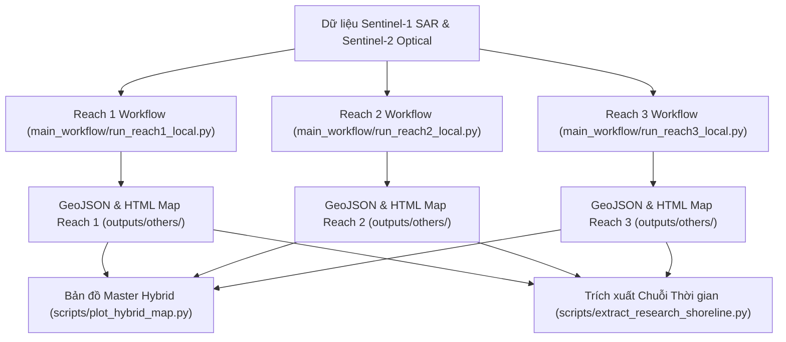

# 🚀 Hướng Dẫn Vận Hành & Sử Dụng Mã Nguồn Dự Án Giám Sát Đường Bờ Sông Hồng (SongHong-SAR-Monitoring)

> **SongHong SAR Monitoring** là hệ thống viễn thám tự động hóa kết hợp **Google Earth Engine (GEE)** và **Python Machine Learning (Random Forest 17-band feature stack + Otsu dynamic calibration)** nhằm giám sát động lực học đường bờ và bãi bồi Sông Hồng qua Hà Nội (171.84 km) bằng dữ liệu Sentinel-1 SAR & Sentinel-2 Optical.

---

## 🛠️ 1. Yêu Cầu Môi Trường & Cài Đặt (Prerequisites & Setup)

### 1.1 Môi trường Python
* **Python Version:** Python 3.10 trở lên.
* **Cài đặt thư viện phụ thuộc:**
  ```bash
  pip install earthengine-api geemap geopandas shapely rasterio folium scikit-learn matplotlib seaborn networkx pandas geedim
  ```

### 1.2 Xác thực Google Earth Engine (GEE API)
Dự án sử dụng GEE API để truy vấn ảnh Sentinel-1 SAR/Sentinel-2 Optical và tính toán chỉ số địa hình (HAND/Slope). Bạn cần xác thực tài khoản GEE trước khi chạy:
```bash
earthengine authenticate
```
> [!NOTE]
> Mã nguồn mặc định sử dụng GEE Project ID: `songhong-sar-monitoring` (Phiên bản `v1.0-OptionA-Production`). Bạn có thể thay đổi ID dự án trong file [src/config.py](file:///d:/Future%20Career/SongHong-SAR-Monitoring/src/config.py).

---

## ⚡ 2. Hướng Dẫn Sử Dụng Mã Nguồn Nhanh (Quickstart CLI - `main.py`)

Hệ thống được tích hợp bộ điều khiển tập trung [main.py](file:///d:/Future%20Career/SongHong-SAR-Monitoring/main.py) giúp bạn chạy mô hình bằng 1 dòng lệnh duy nhất:

### 🟢 2.1 Chạy Toàn Bộ Hệ Thống (Reaches 1, 2, 3 + Master Hybrid Map)
```bash
python main.py --reach all
```
* **Thực thi:** Tự động chạy lần lượt Reach 1, Reach 2, Reach 3 cho cả mùa khô và mùa mưa năm 2024, sau đó tự động ghép nối bản đồ tương tác Master Hybrid cho toàn tuyến 171.84 km sông Hồng.

### 🟡 2.2 Chạy Riêng Từng Phân Đoạn Sông (Single Reach Execution)
```bash
# Chạy riêng Reach 1 (Thượng lưu: Sơn Tây - Ba Vì)
python main.py --reach 1

# Chạy riêng Reach 2 (Trung lưu: Nội đô Hà Nội)
python main.py --reach 2

# Chạy riêng Reach 3 (Hạ lưu: Phú Xuyên - Thường Tín)
python main.py --reach 3
```

### 🗺️ 2.3 Cập Nhật Bản Đồ Tương Tác Master Hybrid
```bash
python main.py --hybrid
```

### 🚀 2.4 Trích Xuất Chuỗi Thời Gian 10 Năm (2017 – 2026)
```bash
python main.py --full-composite
```

---

## 🏃 3. Luồng Xử Lý Mã Nguồn Chi Tiết (Detailed Modular Workflow)

Quy trình xử lý được mô-đun hóa độc lập và có thể chạy trực tiếp từ thư mục `main_workflow/`:



### 3.1 Chi Tiết Các Script Trong `main_workflow/`

1. **Reach 1 (`main_workflow/run_reach1_local.py`)**:
   - Khúc uốn Sơn Tây – Ba Vì: Tích hợp bộ lọc bóng núi địa hình (HAND & Slope) và 10th Percentile Reducer (P10).
   - Sai số vị trí mùa khô đạt **RMSE $48.82\text{m}$** (Giảm **-31.0%** so với Baseline).

2. **Reach 2 (`main_workflow/run_reach2_local.py`)**:
   - Hà Nội Nội đô: Tích hợp thuật toán Bridge Piercing (Nối bờ qua 6 cầu lớn) và Island Buffer Overlay.
   - Sai số vị trí mùa khô đạt **RMSE $35.98\text{m}$** (Tiệm cận chuẩn Tốt).

3. **Reach 3 (`main_workflow/run_reach3_local.py`)**:
   - Phú Xuyên – Thường Tín: Xử lý vùng bãi nông và nước phù sa đục.
   - Đạt độ chính xác tuyệt đối: Mùa khô **RMSE $18.72\text{m}$ ($< 2.0\text{ pixels}$)** & Mùa mưa **RMSE $25.72\text{m}$ ($< 3.0\text{ pixels}$)** — **Đạt chuẩn công bố khoa học (High Precision)**.

---

## ⚙️ 4. Hướng Dẫn Tùy Biến Tham Số Mã Nguồn (Code Customization Guide)

### 4.1 Cấu Hình Hệ Thống Trong `src/config.py`
Bạn có thể thay đổi các tham số cốt lõi trong file [src/config.py](file:///d:/Future%20Career/SongHong-SAR-Monitoring/src/config.py):

- **Đổi GEE Project ID:**
  ```python
  GEE_PROJECT = 'ten-du-an-gee-cua-ban'
  ```
- **Tùy chỉnh mô hình Random Forest:**
  ```python
  RF_NUM_TREES = 200  # Số lượng cây quyết định
  CLASSIFIER_FEATURES = [
      'VV', 'VH', 'VV_ratio', 'VV_sum', 'VV_mean',
      'VV_contrast', 'VV_entropy', 'VV_homogeneity',
      'VV_correlation', 'VV_ASM', 'VV_variance',
      'VH_contrast', 'VH_entropy', 'VH_homogeneity',
      'VH_correlation', 'VH_ASM', 'VH_variance'
  ]
  ```

### 4.2 Điều Chỉnh Thuật Toán Làm Mịn Đường Bờ Trong `src/shoreline.py`
Hàm `smooth_and_simplify_shoreline()` trong [src/shoreline.py](file:///d:/Future%20Career/SongHong-SAR-Monitoring/src/shoreline.py) sử dụng thuật toán Douglas-Peucker và B-Spline:
```python
# Điều chỉnh độ đơn giản hóa đỉnh (ngưỡng tối đa Hausdorff deviation):
tolerance_m = 15.0  # Mặc định 15m (cho kết quả giảm -73% số đỉnh mà vẫn giữ đúng dáng bờ)
```

---

## 📊 5. Quy Chuẩn Bảng Đánh Giá Mức Độ Sai Số Vị Trí (Validation Rating Table)

Tất cả các bản đồ HTML tương tác xuất ra từ hệ thống đều tích hợp sẵn bảng phân cấp sai số vị trí theo đúng chuẩn khoa học viễn thám:

| Mức độ (Rating) | RMSE Distance | Quy đổi Số lượng Pixel (ảnh 10m) | Ý nghĩa Thực tiễn & Học thuật |
| :--- | :---: | :---: | :--- |
| 🟢 **Tốt (Good)** | $< 30\text{m}$ | $< 3\text{ pixels}$ | **Đạt chuẩn công bố khoa học (High Precision).** Bắt chính xác sự thay đổi của bãi bồi/đường bờ. |
| 🟡 **Trung bình (Moderate)** | $30\text{m} - 70\text{m}$ | $3 - 7\text{ pixels}$ | **Đạt chuẩn giám sát quy mô vùng (Regional Scale).** Nhận diện tốt xu hướng biến động tích tụ/sạt lở diện rộng. |
| 🔴 **Kém (Poor)** | $> 70\text{m}$ | $> 7\text{ pixels}$ | **Chưa đạt yêu cầu (High Error).** Sai số do nhiễu speckle radar, phù sa đục hoặc cầu/công trình nhân tạo. |

---

## 📁 6. Cấu Trúc Mã Nguồn & Thư Mục Dữ Liệu Tối Ưu

```
SongHong-SAR-Monitoring/
├── main.py                      # ⚡ Bộ điều khiển CLI tập trung (Quickstart Runner)
├── WALKTHROUGH.md               # 📖 Hướng dẫn vận hành chi tiết
├── README.md                    # 📄 Hướng dẫn tổng quan dự án
├── main_workflow/               # 🚀 Các kịch bản chạy mô hình theo Reach (1, 2, 3)
│   ├── run_reach1_local.py
│   ├── run_reach2_local.py
│   └── run_reach3_local.py
├── scripts/                     # 🛠️ Script vẽ bản đồ Master & chạy batch chuỗi thời gian
│   ├── plot_hybrid_map.py
│   ├── train_classifier.py
│   └── extract_research_shoreline.py
├── src/                         # 🧩 Mã nguồn Python Core Package
│   ├── config.py                # Cấu hình tham số & GEE project ID
│   ├── aoi.py                   # Nạp & biến đổi dữ liệu không gian AOI
│   ├── collection.py            # P10 Reducer Multi-temporal Compositing & Refined Lee
│   ├── classification.py        # Random Forest & Fast Focal Neighborhood Textures
│   ├── preprocessing.py         # Khử nhiễu biên ảnh & Speckle filtering
│   ├── shoreline.py             # Lọc hình thái học, Active Channel 150m, Smoothing & KD-Tree
│   └── utils.py                 # Hàm tính toán địa lý & UTM reprojection
├── aoi/                         # 📐 Dữ liệu không gian GeoJSON chính thức (AOI, Centerline, Training)
├── data/                        # 💾 Dữ liệu ground truth Sentinel-2 MNDWI cache (2017-2026)
├── docs/                        # 📚 Tài liệu tham khảo, đề cương & mô tả mô hình (model.md)
└── outputs/                     # 📦 Kết quả đầu ra
    ├── map/                     # 🗺️ 8 Bản đồ tương tác Folium HTML (Master Hybrid & Reach)
    ├── REPORT/                  # 📄 Báo cáo khoa học (MD/TeX), Slides HTML & 30 Hình ảnh PNG
    └── others/                  # 📐 GeoJSON đường bờ vector sản xuất & CSV kiểm chứng
```

---

## 📌 7. Kết Quả Kiểm Chứng Thực Nghiệm Mẫu Năm 2024

Kết quả kiểm chứng KD-Tree chính thức trên bộ mẫu năm 2024 (Phiên bản `v1.0-OptionA-Production`):

* **Reach 1 (Upper - Mùa Khô / Mùa Mưa):** RMSE **$48.82\text{m}$ / $54.24\text{m}$** *(Đạt chuẩn Trung bình - Regional Scale, giảm -31% sai số Mùa khô)*.
* **Reach 2 (Middle - Mùa Khô / Mùa Mưa):** RMSE **$35.98\text{m}$ / $44.74\text{m}$** *(Đạt chuẩn Tiệm cận Tốt / Trung bình - Regional Scale)*.
* **Reach 3 (Lower - Mùa Khô / Mùa Mưa):** RMSE **$18.72\text{m}$ / $25.72\text{m}$** *(Đạt chuẩn **Tốt xuất sắc - High Precision**, $< 2 - 3\text{ pixels}$)*.
