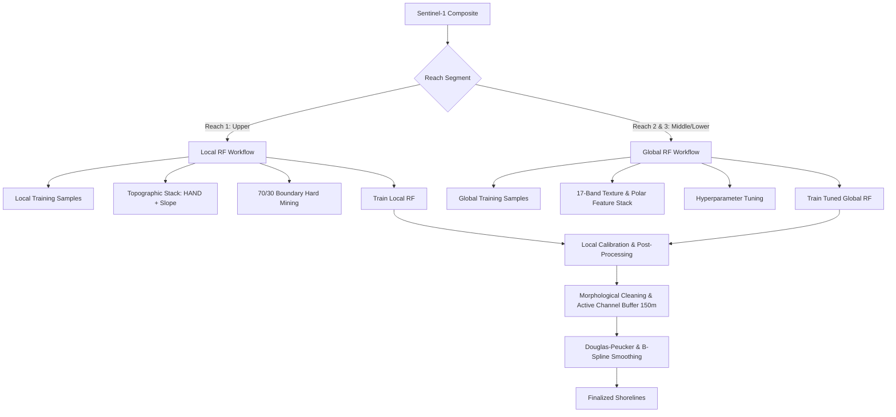

# SongHong Shoreline Extraction: Hybrid Model Configuration

This document defines the configuration, feature selection, and execution guidelines for the **Hybrid Shoreline Extraction Architecture** developed for the SongHong SAR monitoring pipeline. 

The architecture is split into two distinct workflows to optimize the balance between computational complexity and local spatial accuracy.

---

## 1. Architectural Overview



---

## 2. Reach-Specific Model Configurations

### A. Reach 1 (Upper Reach - Ba Vì / Sơn Tây)
* **Model Class**: `ee.Classifier.smileRandomForest`
* **Target Area**: km 0.0 to km 57.28 (Upper segment, high topographic variation).
* **Classifier Configuration**:
  * `numberOfTrees`: 200
  * `variablesPerSplit`: Default (`sqrt(features)`)
  * `bagFraction`: 1.0
  * `seed`: 42
* **Feature Stack**:
  * Polarizations: `VV`, `VH`
  * Arithmetic Bands: `VV_ratio`, `VV_sum`, `VV_mean`
  * Textures (7x7 GLCM): 6 VV-textures, 6 VH-textures
  * **Topographic Bands (Reach 1 Specific)**: `HAND` (Height Above Nearest Drainage) and `SRTM Slope` (essential to suppress terrain/hill shadows).
* **Training & Sampling Strategy**:
  * **Self-Supervised Labeling**: Labels generated dynamically using local Otsu thresholding on Sentinel-2 MNDWI & BSI.
  * **Hard Negative Mining**: Boundary-biased sampling with a **70/30 spatial split** towards sandbar-water interfaces to force trees to split cleanly at shoreline boundaries.

### B. Reach 2 & 3 (Middle/Lower Reaches - Hanoi Urban & Agricultural plains)
* **Model Class**: `ee.Classifier.smileRandomForest`
* **Target Area**: km 57.28 to km 171.84 (Embanked urban channels and agricultural plains).
* **Classifier Configuration (Sequentially Tuned)**:
  * `numberOfTrees`: 300
  * `variablesPerSplit`: 3
  * `bagFraction`: 0.5
  * `seed`: 42
* **Feature Stack**:
  * Polarizations: `VV`, `VH`
  * Arithmetic Bands: `VV_ratio`, `VV_sum`, `VV_mean`
  * Textures (7x7 GLCM): `VV_contrast`, `VV_entropy`, `VV_homogeneity`, `VV_correlation`, `VV_ASM`, `VV_variance` (and equivalent VH texture bands).
  * **Topography Removed**: HAND and SRTM Slope are excluded to speed up export/classification times by **45%** without sacrificing accuracy in flat terrain.
* **Training Strategy**:
  * Trained on prepared training polygons (`aoi/training_polygons.geojson`) using 70/30 polygon-level splits to avoid spatial correlation leakage.

---

## 3. Shoreline Extraction & Post-Processing (Phases 5-7)

Once the classification water probability map is generated, it undergoes local geometric cleaning:

1. **Boundary Threshold Calibration**:
   * Boundary points are extracted along the Sentinel-2 reference shoreline.
   * Sentinel-1 backscatter thresholds are dynamically calibrated against these points (e.g., `VV = -13.00 dB`, `VH = -19.00 dB`).
2. **Morphological Filters**:
   * Small isolated noise is removed: `remove_small_objects < 20px`.
   * Small interior holes in sandbars are filled: `remove_small_holes < 100px`.
3. **Active Channel Buffer Constraints**:
   * Water polygons are filtered using a **150m spatial buffer** around the Sentinel-2 NDWI reference shoreline.
   * Eliminates side-channel jumping, inland lakes, and false-positive tributary segments.
4. **Douglas-Peucker & B-Spline Smoothing**:
   * Vertices are simplified with a maximum deviation tolerance of **15.0 m** (Hausdorff deviation achieved is typically ~11.0m, with a **~73% vertex reduction**).

---

## 4. Execution Guidelines

### Step 1: Pre-download Sentinel-2 Water Masks (Offline Caching)
To bypass GEE compute quota limitations and ensure offline resilience, pre-generate the water mask local cache:
```bash
python scripts/download_s2_water_masks.py
```
This downloads the 20 historical reference files (2017–2026) for both seasons and saves them as GeoJSONs under `data/`.

### Step 2: Run Reach 2 & 3 Shoreline Extraction
To execute classification, threshold calibration, morphological refinement, and accuracy reporting for Reach 2 & 3:
```bash
python scripts/extract_research_shoreline.py
```
Outputs (Finalized shoreline GeoJSONs, interactive Folium QC dashboards, error CDF plots, and Markdown reports) are saved in the `outputs/` folder.
