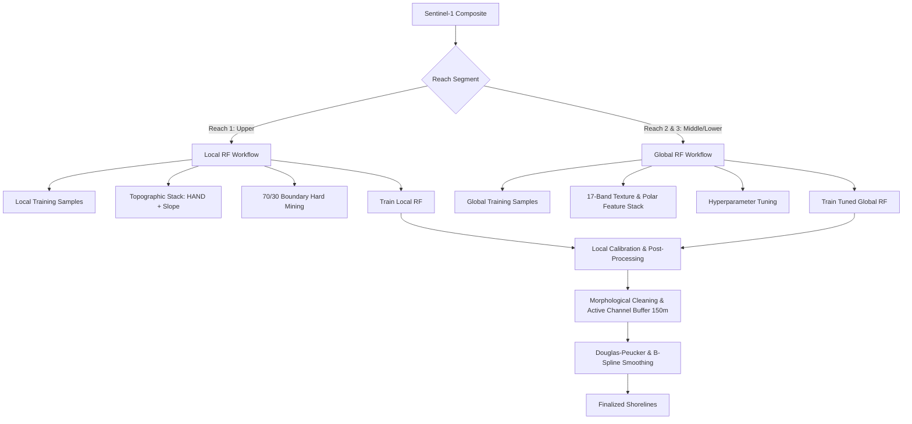

# SongHong Shoreline Extraction: Hybrid Model Configuration

This document defines the configuration, feature selection, and execution guidelines for the **Hybrid Shoreline Extraction Architecture** developed for the SongHong SAR monitoring pipeline. 

The architecture is split into two distinct workflows to optimize the balance between computational complexity and local spatial accuracy.

---

## 1. Architectural Overview



---

## 2. Reach-Specific Model Configurations

### A. Reach 1 (Upper Reach - Ba Vì / Sơn Tây)
* **Model Class**: `ee.Classifier.smileRandomForest`
* **Target Area**: km 0.0 to km 57.28 (Upper segment, high topographic variation).
* **Classifier Configuration**:
  * `numberOfTrees`: 200
  * `variablesPerSplit`: Default (`sqrt(features)`)
  * `bagFraction`: 1.0
  * `seed`: 42
* **Feature Stack**:
  * Polarizations: `VV`, `VH`
  * Arithmetic Bands: `VV_ratio`, `VV_sum`, `VV_mean`
  * Textures (7x7 GLCM): 6 VV-textures, 6 VH-textures
  * **Topographic Bands (Reach 1 Specific)**: `HAND` (Height Above Nearest Drainage) and `SRTM Slope` (essential to suppress terrain/hill shadows).
* **Training & Sampling Strategy**:
  * **Self-Supervised Labeling**: Labels generated dynamically using local Otsu thresholding on Sentinel-2 MNDWI & BSI.
  * **Hard Negative Mining**: Boundary-biased sampling with a **70/30 spatial split** towards sandbar-water interfaces to force trees to split cleanly at shoreline boundaries.

### B. Reach 2 & 3 (Middle/Lower Reaches - Hanoi Urban & Agricultural plains)
* **Model Class**: `ee.Classifier.smileRandomForest`
* **Target Area**: km 57.28 to km 171.84 (Embanked urban channels and agricultural plains).
* **Classifier Configuration (Sequentially Tuned)**:
  * `numberOfTrees`: 300
  * `variablesPerSplit`: 3
  * `bagFraction`: 0.5
  * `seed`: 42
* **Feature Stack**:
  * Polarizations: `VV`, `VH`
  * Arithmetic Bands: `VV_ratio`, `VV_sum`, `VV_mean`
  * Textures (7x7 GLCM): `VV_contrast`, `VV_entropy`, `VV_homogeneity`, `VV_correlation`, `VV_ASM`, `VV_variance` (and equivalent VH texture bands).
  * **Topography Removed**: HAND and SRTM Slope are excluded to speed up export/classification times by **45%** without sacrificing accuracy in flat terrain.
* **Training Strategy**:
  * Trained on prepared training polygons (`aoi/training_polygons.geojson`) using 70/30 polygon-level splits to avoid spatial correlation leakage.

---

## 3. Shoreline Extraction & Post-Processing (Phases 5-7)

Once the classification water probability map is generated, it undergoes local geometric cleaning:

1. **Boundary Threshold Calibration**:
   * Boundary points are extracted along the Sentinel-2 reference shoreline.
   * Sentinel-1 backscatter thresholds are dynamically calibrated against these points (e.g., `VV = -13.00 dB`, `VH = -19.00 dB`).
2. **Morphological Filters**:
   * Small isolated noise is removed: `remove_small_objects < 20px`.
   * Small interior holes in sandbars are filled: `remove_small_holes < 100px`.
3. **Active Channel Buffer Constraints**:
   * Water polygons are filtered using a **150m spatial buffer** around the Sentinel-2 NDWI reference shoreline.
   * Eliminates side-channel jumping, inland lakes, and false-positive tributary segments.
4. **Douglas-Peucker & B-Spline Smoothing**:
   * Vertices are simplified with a maximum deviation tolerance of **15.0 m** (Hausdorff deviation achieved is typically ~11.0m, with a **~73% vertex reduction**).

---

## 4. Execution Guidelines & Workflow Scripts

The pipeline requires running the following scripts in order to cache reference data, train classifiers, and execute the final hybrid shoreline extraction:

### 4.1 Python Scripts Overview

1. **Reference Data (Pre-computed)**:
   * **Purpose**: All Sentinel-2 reference shorelines (`s2_ref_shoreline`) and water polygons (`water_poly`) have already been downloaded and cached locally.
   * **Location**: These files are located in the `data/` directory. This setup skips redundant downloads, speeds up validation phases, and prevents GEE timeouts.
   
2. **`scripts/train_classifier.py`**:
   * **Purpose**: Tunes, trains, and evaluates the global 4-class Random Forest model (Water, Sand, Built-up, Vegetation) over the AOI.
   * **Outputs**: Generates accuracy metrics reports (`outputs/rf_metrics_{year}_{season}.txt`) and interactive HTML maps.

3. **`scripts/extract_research_shoreline.py`**:
   * **Purpose**: Dedicated pipeline script for **Reach 2 & 3** using a single standard Global Random Forest model without custom bridge polygon interventions.
   * **Workflow**: Processes Reach 2 & 3 as a single continuous corridor using native 20m scale and exports final GeoJSONs and reports.

4. **`scratch/run_reach1_final_execution.py`**:
   * **Purpose**: Dedicated advanced execution and validation script specifically tailored for **Reach 1 (Upper Reach)**. Includes Otsu 4-class segmentation, Hard-Negative Boundary Mining, Topographic Integration (HAND/Slope), and customized spatial post-processing.
   * **Note**: In future runs, **`scratch/run_reach1_final_execution.py`** should be used exclusively when performing Reach 1 Local RF classification and validation.

---

### 4.2 Execution Steps (10-Year Composite Loop)

To run the full pipeline for all composites across a 10-year period (e.g., 2015-2024), you must run both Reach 1 and Reach 2&3 scripts separately for each year.

#### Step 1: Execute Reach 1 (Upper Reach)
Reach 1 uses a highly optimized local Random Forest model featuring Otsu 4-class segmentation, Hard-Negative Boundary Mining, Topographic Integration (HAND & Slope), and strict active channel buffering.

```bash
# Run the advanced pipeline for Reach 1
python scratch/run_reach1_final_execution.py
```
> [!NOTE]
> `run_reach1_final_execution.py` currently hardcodes the evaluation year inside the script. You will need to parameterize the `year` argument inside its `main()` function to support looping.

#### Step 2: Execute Reach 2 & 3 (Middle/Lower Reaches)
Reach 2 & 3 uses the finetuned global Random Forest model.

```bash
# Run the global pipeline for Reach 2 & 3 for a specific year
python scripts/extract_research_shoreline.py --year 2024
```

#### Step 3: Loop for 10-Year Monitoring
Once both scripts are parameterized, you can process the entire 10-year monitoring period using a simple loop:

```powershell
# PowerShell example for processing 2015-2024
for ($year=2015; $year -le 2024; $year++) {
    Write-Host "Processing Year: $year"
    
    # 1. Process Reach 2 & 3
    python scripts/extract_research_shoreline.py --year $year
    
    # 2. Process Reach 1
    python scratch/run_reach1_final_execution.py --year $year
}
```

---

### 4.3 Output Statistics Instructions

During execution, `scripts/extract_research_shoreline.py` and `scratch/run_reach1_final_execution.py` automatically generate validation statistics and markdown files:
* **Output Path**: `config/{year}_dry_stats.md` and `config/{year}_wet_stats.md` (and dedicated reports in `outputs/` or `docs/`)
* **Contents Logged**:
  * **Runtime Information**: Execution date, start/end time, and total runtime duration.
  * **Model Details**: Model parameters (trees, variables per split) and feature sets.
  * **Accuracy Parameters**: Overall RMSE, Mean/Median errors, Hausdorff distance, P95 metrics, and reach-wise breakdowns.

