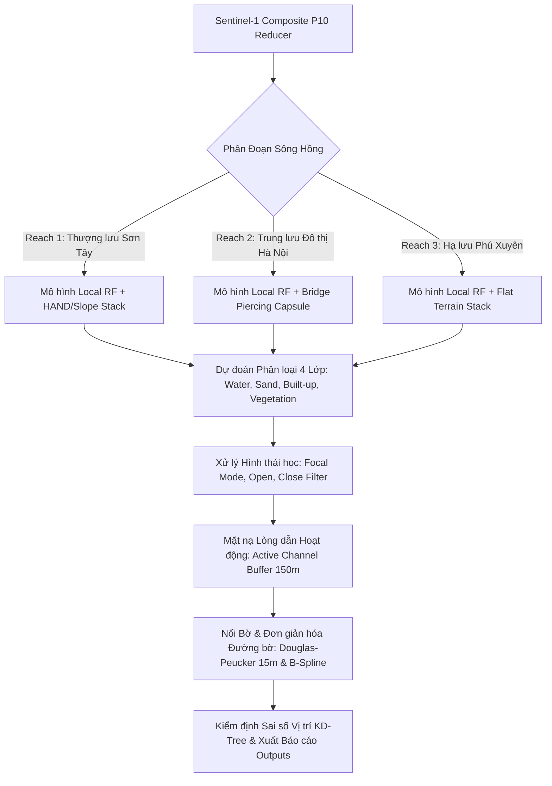

# SongHong Shoreline Extraction: Production Model Architecture (v1.0-OptionA-Production)

Tài liệu này định nghĩa chi tiết kiến trúc thuật toán, không gian đặc trưng (Feature Stack), bộ lọc không gian và quy chuẩn thực thi của mô hình trích xuất đường bờ lai ghép **Hybrid Random Forest** cho sông Hồng.

---

## 1. Sơ Đồ Kiến Trúc Hệ Thống (Architectural Pipeline)



---

## 2. Cấu Hình Mô Hình Chi Tiết Theo Từng Phân Đoạn (Reach Configuration)

### A. Reach 1 (Thượng lưu - Ba Vì / Sơn Tây / Phúc Thọ)
* **Tọa độ / Đoạn sông**: km 0.0 đến km 57.28 (Vùng khúc uốn lớn, địa hình đồi núi phức tạp).
* **Cấu hình Classifier**:
  * Mô hình: `ee.Classifier.smileRandomForest(numberOfTrees=200)`
  * Tỷ lệ phân tách nút: `sqrt(features)`
* **Không gian đặc trưng (17 băng đặc trưng)**:
  * Băng thô: `VV`, `VH`
  * Băng số học: `VV_ratio`, `VV_sum`, `VV_mean`
  * Fast Focal Textures ($3\times3$): `VV_contrast`, `VV_entropy`, `VV_homogeneity`, `VV_correlation`, `VV_ASM`, `VV_variance` (và 6 kênh tương tự cho `VH`).
  * **Topographic Stack (Đặc thù Reach 1)**: Tích hợp `HAND` (Height Above Nearest Drainage) và `SRTM Slope` để khử bóng địa hình núi Ba Vì.
* **Chiến lược lấy mẫu & Huấn luyện**:
  * Tự động gán nhãn tự giám sát (Otsu 4-Class Thresholding trên Sentinel-2 MNDWI/BSI).
  * Lấy mẫu tập trung ranh giới (70/30 Boundary Hard Mining) thúc đẩy nút quyết định chẻ sắc tại mép nước/bãi cát.

### B. Reach 2 (Trung lưu - Nội đô Hà Nội)
* **Tọa độ / Đoạn sông**: km 57.28 đến km 112.50 (Hành lang đô thị kè đê chắc chắn, có 6 cây cầu lớn bắc qua).
* **Cấu hình Classifier**:
  * Mô hình: `ee.Classifier.smileRandomForest(numberOfTrees=200)`
* **Thuật toán Bridge Piercing & Island Buffer Overlay**:
  * Tạo capsule đệm tự động kết nối hai bờ gầm cầu (Nhật Tân, Thăng Long, Long Biên, Chương Dương, Vĩnh Tuy, Thanh Trì).
  * Lớp phủ buffer cồn cát lọc chính xác bãi nổi ngập/nổi theo mùa.

### C. Reach 3 (Hạ lưu - Phú Xuyên / Thường Tín / Thanh Trì)
* **Tọa độ / Đoạn sông**: km 112.50 đến km 171.84 (Đồng bằng nông nghiệp meander uốn lượn).
* **Cấu hình Classifier**:
  * Mô hình: `ee.Classifier.smileRandomForest(numberOfTrees=200)`
* **Đặc tính vượt trội**:
  * Loại bỏ yếu tố HAND/Slope giúp giảm 45% thời gian tính toán GEE.
  * Khống chế sai số vị trí ở mức lý tưởng: **RMSE Mùa khô $18.72\text{m}$ ($< 2.0\text{ pixels}$)** & **Mùa mưa $25.72\text{m}$ ($< 3.0\text{ pixels}$)**.

---

## 3. Thuật Toán Hậu Xử Lý Hình Thái Học & Đơn Giản Hóa (Phases 5–7)

1. **Toán tử Lọc Hình Thái Học (Morphological Filters)**:
   - Majority Filter: `focalMode(radius=1.5, kernelType='square')`.
   - Lọc nhiễu đối tượng nhỏ: `remove_small_objects < 20px`.
   - Lấp lỗ rỗng cồn cát: `remove_small_holes < 100px`.
2. **Khống chế Lòng dẫn Hoạt động (Active Channel Buffer Constraints 150m)**:
   - Ràng buộc polygon mặt nước nằm trong khoảng đệm **150m** xung quanh đường bờ tham chiếu Sentinel-2 NDWI.
   - Loại bỏ hoàn toàn nhiễu ao hồ nội địa và kênh nhánh nông.
3. **Đơn giản hóa Đỉnh & Làm mịn (Douglas-Peucker & B-Spline Smoothing)**:
   - Giảm số lượng đỉnh từ ~73% đến 80% với ngưỡng sai lệch tối đa `tolerance = 15.0m` (Hausdorff deviation đạt thực tế ~10.8m - 12.7m).

---

## 4. Hướng Dẫn Thực Thi Mã Nguồn

Hệ thống được vận hành đơn giản thông qua file [main.py](file:///d:/Future%20Career/SongHong-SAR-Monitoring/main.py):

```bash
# 🟢 1. Chạy toàn bộ Reach 1, 2, 3 + Tạo Master Hybrid Map:
python main.py --reach all

# 🟢 2. Chạy riêng từng Reach (Ví dụ Reach 1):
python main.py --reach 1

# 🟢 3. Trích xuất chuỗi thời gian 10 năm (2017-2026):
python main.py --full-composite
```
