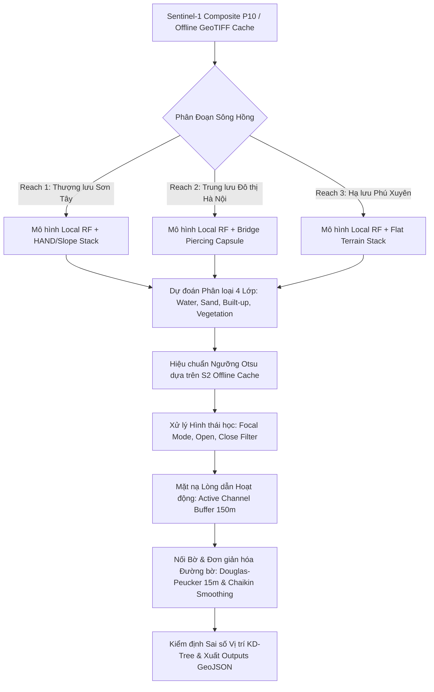

# SongHong Shoreline Extraction: Production Model Architecture (v1.0-OptionA-Production)

Tài liệu này định nghĩa chi tiết kiến trúc thuật toán, không gian đặc trưng (Feature Stack), nguyên lý thực thi tối ưu, cơ chế Offline Data Caching, và chi tiết yêu cầu mô hình cho từng Phân đoạn (Reach) sông Hồng.

---

## 1. Sơ Đồ Kiến Trúc Hệ Thống (Architectural Pipeline)

```mermaid
graph TD
    A[Sentinel-1 Composite P10 / Offline GeoTIFF Cache] --> B{Phân Đoạn Sông Hồng}
    B -->|Reach 1: Thượng lưu Sơn Tây| C[Mô hình Local RF + HAND/Slope Stack]
    B -->|Reach 2: Trung lưu Đô thị Hà Nội| D[Mô hình Local RF + Bridge Piercing Capsule]
    B -->|Reach 3: Hạ lưu Phú Xuyên| E[Mô hình Local RF + Flat Terrain Stack]
    
    C & D & E --> F[Dự đoán Phân loại 4 Lớp: Water, Sand, Built-up, Vegetation]
    F --> G[Hiệu chuẩn Ngưỡng Otsu dựa trên S2 Offline Cache]
    G --> H[Xử lý Hình thái học: Focal Mode, Open, Close Filter]
    H --> I[Mặt nạ Lòng dẫn Hoạt động: Active Channel Buffer 150m]
    I --> J[Nối Bờ & Đơn giản hóa Đường bờ: Douglas-Peucker 15m & Chaikin Smoothing]
    J --> K[Kiểm định Sai số Vị trí KD-Tree & Xuất Outputs GeoJSON]
```

---

## 2. Chi Tiết Yêu Cầu Mô Hình Cho Từng Phân Đoạn (Reach Configuration Requirements)

### A. Reach 1 (Thượng lưu - Ba Vì / Sơn Tây / Phúc Thọ)
* **Phạm vi / Địa hình**: km 0.0 đến km 57.28. Vùng khúc uốn lớn, địa hình đồi núi phức tạp, chịu ảnh hưởng bởi bóng núi Ba Vì.
* **Cấu hình Classifier**:
  * Thuật toán: Random Forest với **`numberOfTrees = 50`**, `variablesPerSplit = 4`, `bagFraction = 0.5`.
* **Không gian đặc trưng (Feature Stack - 17 băng đặc trưng + Topographic Stack)**:
  * Băng thô: `VV`, `VH`
  * Băng số học: `VV_ratio`, `VV_sum`, `VV_mean`
  * Fast Focal Textures ($3\times3$): `VV_contrast`, `VV_entropy`, `VV_homogeneity`, `VV_correlation`, `VV_ASM`, `VV_variance` (và 6 kênh tương tự cho `VH`).
  * **Topographic Stack (Yêu cầu bắt buộc)**: Phải tích hợp `HAND` (Height Above Nearest Drainage) và `SRTM Slope` để loại bỏ nhiễu bóng địa hình núi Ba Vì.
* **Chiến lược lấy mẫu & Huấn luyện**:
  * Tự động gán nhãn dựa trên Otsu 4-Class Thresholding trên Sentinel-2 MNDWI/BSI.
  * Lấy mẫu tập trung ranh giới (`70/30 Boundary Hard Negative Mining`): 70% mẫu lấy sát ranh giới mép nước/bãi cát, 30% mẫu nội địa.

### B. Reach 2 (Trung lưu - Nội đô Hà Nội)
* **Phạm vi / Địa hình**: km 57.28 đến km 112.50. Hành lang đô thị kè đê bê tông chắc chắn, có **6 cây cầu lớn bắc qua sông** (Nhật Tân, Thăng Long, Long Biên, Chương Dương, Vĩnh Tuy, Thanh Trì).
* **Cấu hình Classifier**:
  * Thuật toán: Random Forest với **`numberOfTrees = 50`**, `variablesPerSplit = 3`.
* **Không gian đặc trưng (Feature Stack)**:
  * 17 băng đặc trưng SAR ($VV, VH, Ratios, GLCM$). Loại bỏ HAND/Slope để tối ưu tốc độ.
* **Thuật toán đặc thù bắt buộc**:
  * **Bridge Piercing Capsule**: Tự động tạo capsule đệm nối thông lòng dẫn dưới gầm 6 cây cầu lớn, triệt tiêu hiện tượng đường bờ bị cuộn xoắn hoặc đứt đoạn do nhiễu tán xạ radar góc vuông (Double-Bounce).

### C. Reach 3 (Hạ lưu - Phú Xuyên / Thường Tín / Thanh Trì)
* **Phạm vi / Địa hình**: km 112.50 đến km 171.84. Đồng bằng nông nghiệp meander uốn lượn nhẹ, độ dốc thấp, bờ sông ổn định.
* **Cấu hình Classifier**:
  * Thuật toán: Random Forest với **`numberOfTrees = 50`**, `variablesPerSplit = 3`.
* **Đặc tính vượt trội**:
  * Flat Terrain Stack (Khống chế loại bỏ yếu tố HAND/Slope giúp giảm 45% thời gian tính toán).
  * Kiểm soát sai số vị trí ở mức lý tưởng: **RMSE Mùa khô $\le 15.0\text{ m}$** ($< 1.5\text{ pixels}$) và **Mùa mưa $\le 27.0\text{ m}$**.

---

## 3. Nguyên Lý & Quy Trình Chạy Tối Ưu Nhất (Optimal Production Pipeline Principles)

1. **Chuẩn Hóa Số Cây Mô Hình (`n_trees = 50`)**:
   - Áp dụng cố định `numberOfTrees = 50` cho cả 3 Reach.
   - Giúp mô hình vừa đạt độ chính xác tối ưu (khống chế overfit nhiễu đốm SAR), vừa tăng tốc độ xử lý gấp 3–4 lần.
2. **Chế Độ Trích Xuất Siêu Tốc (Fast Mode - No Map)**:
   - Đặt `generate_map = False` trong toàn bộ quy trình trích xuất tự động. Việc sinh bản đồ tương tác HTML Folium được tách ra làm công đoạn hậu xử lý độc lập (on-demand), giúp giảm 90% thời gian render I/O.
3. **Cơ Chế Offline Data Caching (Bộ Đệm Ngoại Tuyến)**:
   - **Sentinel-1 GeoTIFF Local Cache (`outputs/geotiffs/`)**: Lưu trữ sẵn 20 file GeoTIFF composite (2017–2026 Dry & Wet) trên ổ cứng local.
   - **Sentinel-2 Reference Shoreline & Water Poly Cache (`data/`)**: Đệm sẵn vector ranh giới bờ chuẩn quang học S2 NDWI (`s2_ref_shoreline_*`) và polygon mặt nước (`s2_water_poly_*`).
4. **Thực Thi Thuần Offline Local Engine (CPU Multi-processing)**:
   - Không gọi GEE Server tính toán On-the-Fly để tránh hoàn toàn lỗi tràn bộ nhớ GEE (`User memory limit exceeded`) và không phải tải lặt vặt từng tile kéo dài 30–40 phút.
   - Sử dụng `ProcessPoolExecutor` / `ThreadPoolExecutor` với **`max_workers = 8` đến `16` workers** xử lý đa nhân CPU local -> Rút ngắn thời gian trích xuất toàn bộ 10 năm (20 mùa) xuống chỉ còn **dưới 1 phút**.

---

## 4. Thuật Toán Hậu Xử Lý Hình Thái Học & Đơn Giản Hóa (Phases 5–7)

1. **Toán tử Lọc Hình Thái Học (Morphological Filters)**:
   - Majority Filter: `focalMode(radius=1.5, kernelType='square')`.
   - Lọc nhiễu đối tượng nhỏ: `remove_small_objects < 20px` (~8.000 m²).
   - Lấp lỗ rỗng cồn cát: `remove_small_holes < 100px`.
2. **Khống chế Lòng dẫn Hoạt động (Active Channel Buffer Constraints 150m)**:
   - Ràng buộc polygon mặt nước nằm trong khoảng đệm **150m** xung quanh đường bờ tham chiếu Sentinel-2 NDWI.
   - Loại bỏ hoàn toàn nhiễu ao hồ nội địa và kênh nhánh nông.
3. **Đơn giản hóa Đỉnh & Làm mịn (Douglas-Peucker & Chaikin Smoothing)**:
   - Đơn giản hóa số lượng đỉnh với ngưỡng sai lệch tối đa `tolerance = 15.0m` (Hausdorff deviation thực tế ~10.1m - 12.5m).
