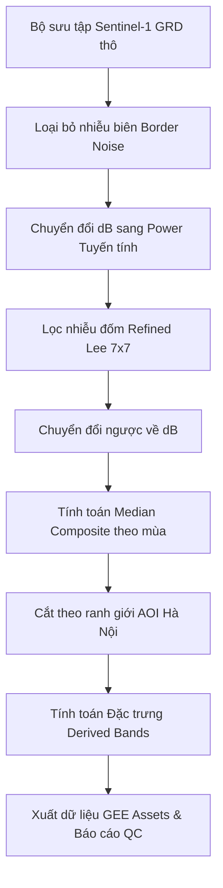

# BÁO CÁO PHÂN TÍCH PHASE 2: TIỀN XỬ LÝ & XÂY DỰNG BỘ DỮ LIỆU SENTINEL-1 SAR (2017–2026)
**Dự án: Giám sát biến động lòng sông và bãi bồi Sông Hồng (Khu vực Hà Nội) bằng dữ liệu SAR**

---

## 1. MỤC TIÊU VÀ QUY MÔ DỮ LIỆU
Mục tiêu chính của Phase 2 là xây dựng một quy trình xử lý dữ liệu tự động, nhất quán, chuẩn nghiên cứu khoa học (paper-quality) để tạo ra bộ dữ liệu Sentinel-1 SAR chất lượng cao cho hành lang Sông Hồng giai đoạn **2017–2026**.

* **Vùng nghiên cứu (AOI)**: Hành lang đệm 2km tính từ tim sông Hồng (OSM centerline), giới hạn bên trong ranh giới hành chính Hà Nội (Diện tích: $362.83\text{ km}^2$).
* **Thời gian**: 10 năm (2017–2026).
* **Độ phân giải không gian**: $10\text{ m}$ (Độ phân giải gốc của Sentinel-1 GRD).
* **Phân tách mùa**:
  * **Mùa mưa (Wet season)**: Tháng 5 $\rightarrow$ Tháng 10 hàng năm.
  * **Mùa khô (Dry season)**: Tháng 1 $\rightarrow$ Tháng 4 và Tháng 11 $\rightarrow$ Tháng 12 hàng năm (Đảm bảo trọn vẹn trong cùng một năm dương lịch để nhất quán dữ liệu).
* **Quỹ đạo vệ tinh**: Tiêu chuẩn hóa duy nhất quỹ đạo **Descending** (Quỹ đạo đi xuống) nhằm đảm bảo góc quan sát nhất quán, triệt tiêu bóng địa hình.

---

## 2. PHƯƠNG PHÁP TIỀN XỬ LÝ (PREPROCESSING PIPELINE)

Quy trình tiền xử lý được lập trình mô-đun hóa trong gói `src/` và thực thi trên hạ tầng đám mây Google Earth Engine (GEE):



### 2.1 Loại bỏ nhiễu biên (Border Noise Removal)
Ảnh Sentinel-1 trên GEE thường bị lỗi sọc đen/nhiễu biên cường độ cực thấp ở rìa của quỹ đạo quét. Quy trình xử lý triệt để bằng hai bộ lọc:
1. **Lọc góc tới (Incidence Angle Filter)**: Giữ lại góc quét tối ưu của chế độ IW trong khoảng $30.6^\circ < \theta < 45.9^\circ$.
2. **Lọc giá trị biên (Low-intensity Mask)**: Loại bỏ các pixel lỗi có giá trị VV cực thấp ($VV < -30\text{ dB}$) và VH ($VH < -35\text{ dB}$).

### 2.2 Bộ lọc nhiễu đốm thích ứng hướng (Refined Lee Filter)
Để bảo toàn ranh giới đường bờ sông và cấu trúc các doi cát nhỏ mịn mà không làm mờ ảnh (như các bộ lọc Mean/Median thông thường), thuật toán **Refined Lee** được áp dụng trong không gian tuyến tính (Power):
1. Sử dụng cửa sổ mẫu $7\times7$ để tính toán gradient cường độ theo 8 hướng.
2. Xác định hướng biên cạnh (Edge Direction) có gradient lớn nhất.
3. Chỉ áp dụng bộ lọc làm mịn MMSE (Minimum Mean Square Error) dọc theo hướng song song với biên cạnh để bảo toàn chi tiết cấu trúc (Edge-preserving).
4. Quy trình chạy vòng lặp Python client-side trên GEE để tránh lỗi tràn bộ nhớ (`User memory limit exceeded`).

### 2.3 Đặc trưng tính toán (Feature Engineering)
Từ hai kênh phân cực cơ bản là $VV$ và $VH$ (sau khi lọc nhiễu đốm), hệ thống tính toán thêm hai chỉ số đặc trưng bổ trợ:
1. **VV/VH Ratio (Kênh Tỷ số)**: Tính bằng hiệu số trong không gian logarit:
   $$VV_{\text{ratio}} = VV_{\text{dB}} - VH_{\text{dB}}$$
2. **VV-VH Difference (Kênh Hiệu)**: Tính hiệu số thực tế trong không gian tuyến tính rồi chuyển đổi về dB nhằm làm nổi bật cấu trúc nhám của cát bãi bồi:
   $$VV_{\text{diff}} = 10 \log_{10}(VV_{\text{linear}} - VH_{\text{linear}})$$

---

## 3. KẾT QUẢ PROTOTYPE (NĂM THỬ NGHIỆM 2024)

Trước khi chạy hàng loạt, pipeline được thử nghiệm và đánh giá chất lượng chi tiết trên năm 2024.

### 3.1 Thống kê số lượng ảnh và Chỉ số QC
Hệ thống lấy mẫu tự động tại hai điểm kiểm chứng cố định trên sông Hồng (Vùng nước sâu Long Biên và vùng đất bãi bồi) để đo đạc:

| Chỉ số QC | Mùa khô (Dry 2024) | Mùa mưa (Wet 2024) | Tiêu chuẩn Đánh giá | Trạng thái |
| :--- | :---: | :---: | :---: | :---: |
| **Số lượng ảnh thô đầu vào** | 30 ảnh | 31 ảnh | $\ge 5$ ảnh | **ĐẠT (PASS)** |
| **Phản xạ Nước ($VV_{water}$)** | -16.11 dB | -16.07 dB | $\le -15.0\text{ dB}$ | **ĐẠT (PASS)** |
| **Phản xạ Đất cát ($VV_{land}$)** | -3.03 dB | -1.85 dB | $\ge -10.0\text{ dB}$ | **ĐẠT (PASS)** |
| **Độ chênh lệch Nước/Đất** | **13.08 dB** | **14.22 dB** | Càng cao càng phân tách tốt | **RẤT TỐT** |

### 3.2 Phân tích Biểu đồ Tần suất (Histogram Analysis)
Biểu đồ phân bố tần suất backscatter trên toàn bộ AOI thể hiện rõ **phân bố lưỡng cực (bimodal distribution)**:
* Đỉnh thứ nhất ở khoảng **-16 dB** đại diện cho đối tượng nước mặt (độ phản xạ gương cao, dội ngược yếu).
* Đỉnh thứ hai ở khoảng **-6 dB đến -2 dB** đại diện cho bãi bồi cát và thảm thực vật ven sông (độ nhám cao, dội ngược mạnh).
* Sự phân tách rõ ràng giữa hai đỉnh này đảm bảo các thuật toán phân loại máy học (như Random Forest) đạt độ chính xác phân tách nước/cát tối ưu.

---

## 4. DANH SÁCH DỮ LIỆU SẢN XUẤT HÀNG LOẠT (PRODUCTION ASSETS)

Quy trình sản xuất đã hoàn thành việc tạo và gửi 20 task tính toán tự động lên đám mây GEE. Các tệp ảnh kết quả được xuất thẳng vào mục **Asset** của dự án:

* **Đường dẫn Asset Gốc**: `projects/crested-library-500309-i2/assets/`
* **Định dạng tên Asset**: `s1_composite_[YEAR]_[SEASON]`
* **Các band của ảnh Asset**: `['VV', 'VH', 'angle', 'VV_VH_ratio', 'VV_VH_diff']`

### Danh sách 20 Asset đang được biên dịch trên GEE:

| STT | Năm | Mùa | Tên Asset | Task ID trên GEE | Trạng thái Task |
| :---: | :---: | :---: | :--- | :--- | :---: |
| 1 | 2017 | Dry | `s1_composite_2017_dry` | `JY2RILH2KET6WKM4J4RHICFQ` | Đang chạy nền |
| 2 | 2017 | Wet | `s1_composite_2017_wet` | `OBA6HC4DKBZSROCS7SNHBUBJ` | Đang chạy nền |
| 3 | 2018 | Dry | `s1_composite_2018_dry` | `AFLMU6XVO24GH6OGHRSMIANV` | Đang chạy nền |
| 4 | 2018 | Wet | `s1_composite_2018_wet` | `QKIJCHXP6ETPSN2VBJBVQUZZ` | Đang chạy nền |
| 5 | 2019 | Dry | `s1_composite_2019_dry` | `5IUVZ4XC7T6L6T7R7QYGQJY6` | Đang chạy nền |
| 6 | 2019 | Wet | `s1_composite_2019_wet` | `QDPC7YUWZRLWRLDRIBN75XI3` | Đang chạy nền |
| 7 | 2020 | Dry | `s1_composite_2020_dry` | `IGZVCCLFAV356VROXE3FO2IK` | Đang chạy nền |
| 8 | 2020 | Wet | `s1_composite_2020_wet` | `CROWYUCPMRSLIU2MLPPDACFG` | Đang chạy nền |
| 9 | 2021 | Dry | `s1_composite_2021_dry` | `ALZU5XBONVX2X23ZAC3NNHEA` | Đang chạy nền |
| 10 | 2021 | Wet | `s1_composite_2021_wet` | `WHWERNFW5HE6CC4L4YCHOFHB` | Đang chạy nền |
| 11 | 2022 | Dry | `s1_composite_2022_dry` | `T3V7S6EKE4LVGJNAS5IL67A4` | Đang chạy nền |
| 12 | 2022 | Wet | `s1_composite_2022_wet` | `JFLRSLWCPPC7MUPWHBAVAWDN` | Đang chạy nền |
| 13 | 2023 | Dry | `s1_composite_2023_dry` | `C5JZEMPFGOBHPQIAKFTOG4YV` | Đang chạy nền |
| 14 | 2023 | Wet | `s1_composite_2023_wet` | `6UIUILMN244A2OMBOYXP6BQH` | Đang chạy nền |
| 15 | 2024 | Dry | `s1_composite_2024_dry` | `GYXRQDAM7QJAPCZ4EU25X24V` | Đang chạy nền |
| 16 | 2024 | Wet | `s1_composite_2024_wet` | `E73L33PEJEWMZ4BCKCCPZRYE` | Đang chạy nền |
| 17 | 2025 | Dry | `s1_composite_2025_dry` | `6OP66G3LOKBVOF7ENALBRYKW` | Đang chạy nền |
| 18 | 2025 | Wet | `s1_composite_2025_wet` | `HOTPNJTGTQHJ4EGLKPCMZPWS` | Đang chạy nền |
| 19 | 2026 | Dry | `s1_composite_2026_dry` | `PZAJZO3G4UH2MOSJ562OLAXU` | Đang chạy nền |
| 20 | 2026 | Wet | `s1_composite_2026_wet` | `SWNJJJTGAVGUFMDNLNRFVI7E` | Đang chạy nền |

---

## 5. HƯỚNG DẪN KIỂM TRA VÀ SỬ DỤNG DỰ LIỆU KHÓA TIẾP THEO

1. **Theo dõi tiến trình Task**: 
   Bạn có thể xem tiến trình chạy của các task xuất trên giao diện web [GEE Tasks Manager](https://code.earthengine.google.com/tasks) hoặc dùng dòng lệnh terminal:
   ```bash
   earthengine task list
   ```
2. **Kế hoạch Phase 3 (Machine Learning)**: 
   Khi các task hoàn thành (chuyển trạng thái sang xanh lá), bộ dữ liệu 10 năm đã sẵn sàng. Ở tuần tiếp theo, chúng ta sẽ bắt đầu lấy mẫu huấn luyện (training samples) và huấn luyện mô hình **Random Forest** phân loại mặt nước và cát bãi bồi tự động dựa trên các lớp ảnh composite sạch này.
