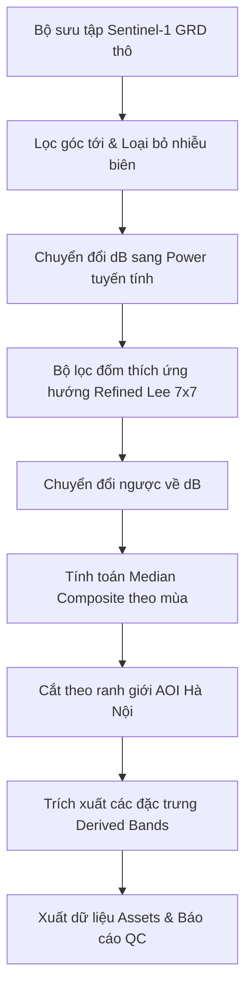

# BÁO CÁO TỔNG HỢP PHASE 1 & PHASE 2: THIẾT LẬP HỆ THỐNG & TIỀN XỬ LÝ DỮ LIỆU SENTINEL-1 SAR (2017–2026)

**Dự án:** Giám sát biến động đường bờ và bãi bồi Sông Hồng tại Hà Nội bằng dữ liệu Sentinel-1 SAR  
**Người thực hiện:** Vũ Đức Tùng  
**Thời gian thực hiện:** Tháng 07/2026  

---

## MỤC LỤC
1. [Giới thiệu & Mục tiêu dự án](#1-giới-thiệu--mục-tiêu-dự-án)
2. [Thu thập & Phân tích dữ liệu gốc (Phase 1)](#2-thu-thập--phân-tích-dữ-liệu-gốc-phase-1)
3. [Quy trình tiền xử lý nâng cao & Đặc trưng trích xuất (Phase 2)](#3-quy-trình-tiền-xử-lý-nâng-cao--đặc-trưng-trích-xuất-phase-2)
4. [Kết quả thử nghiệm Prototype & Kiểm soát chất lượng (QC 2024)](#4-kết-quả-thử-nghiệm-prototype--kiểm-soát-chất-lượng-qc-2024)
5. [Quy trình sản xuất hàng loạt (Production Assets)](#5-quy-trình-sản-xuất-hàng-loạt-production-assets)
6. [Lưu ý quan trọng về dữ liệu năm 2026 & Kế hoạch Phase 3 (Machine Learning)](#6-lưu-ý-quan-trọng-về-dữ-liệu-năm-2026--kế-hoạch-phase-3-machine-learning)

---

## 1. GIỚI THIỆU & MỤC TIÊU DỰ ÁN

Hành lang Sông Hồng qua địa phận Hà Nội có hình thái biến động phức tạp dưới tác động của các yếu tố tự nhiên và hoạt động xả nước từ các đập thủy điện thượng nguồn. Dự án này hướng tới mục tiêu xây dựng một **quy trình tự động hóa trên nền tảng Google Earth Engine (GEE)** để giám sát diễn biến đường bờ, mặt nước và bãi bồi cát trong chuỗi thời gian 10 năm (2017–2026) bằng dữ liệu vệ tinh Radar Sentinel-1 (SAR).

* **Vùng nghiên cứu (AOI):** Hành lang đệm 2km tính từ tim sông Hồng (trích xuất từ đường tim sông OpenStreetMap), kéo dài qua Hà Nội từ Sơn Tây đến Phú Xuyên (Độ dài tuyến ~80km, diện tích AOI: $362.83\text{ km}^2$).
* **Nguồn dữ liệu:** Chuỗi dữ liệu Sentinel-1 Ground Range Detected (GRD).
* **Kết quả kỳ vọng:** Bộ dữ liệu composite mùa khô/mùa mưa được tiền xử lý sạch, đồng nhất; mô hình Random Forest phân loại tự động bãi bồi cát và mặt nước; và chuỗi thống kê diện tích biến động theo thời gian.

---

## 2. THU THẬP & PHÂN TÍCH DỮ LIỆU GỐC (PHASE 1)

Trong Phase 1, dự án tập trung vào việc thiết lập môi trường kết nối GEE, xác định AOI và thu thập, kiểm tra phân phối thời gian của dữ liệu Sentinel-1 để đánh giá mức độ đầy đủ của chuỗi thời gian.

### 2.1 Thông số kỹ thuật Sentinel-1 GRD thô
Dữ liệu đầu vào được giới hạn chặt chẽ theo các tiêu chuẩn kỹ thuật sau để tránh nhiễu do khác biệt góc chiếu:
* **Cảm biến:** C-band Synthetic Aperture Radar (SAR)
* **Chế độ thu nhận:** Interferometric Wide Swath (IW)
* **Quỹ đạo (Orbit Pass):** Chỉ sử dụng quỹ đạo **Descending** (Quỹ đạo đi xuống). Việc đồng nhất hướng bay này giúp triệt tiêu các lỗi do bóng địa hình hoặc sự biến thiên góc nghiêng khi chồng xếp ảnh từ hai quỹ đạo đi lên/xuống khác nhau.
* **Phân cực (Polarizations):** Đồng cực dọc VV (Vertical-Vertical) và phân cực chéo VH (Vertical-Horizontal).
* **Độ phân giải không gian:** 10m.
* **Hệ tọa độ đầu ra:** WGS 84 / UTM Zone 48N (`EPSG:32648`).

### 2.2 Thống kê dữ liệu & Phân tích khoảng trống (Gap Analysis)
Tiến hành truy vấn và thống kê tổng số ảnh Sentinel-1 Descending phủ trọn AOI từ năm 2015 đến 2024. Kết quả ghi nhận tổng cộng **317 ảnh** với tần suất phân bổ ổn định:

| Năm | Số lượng ảnh | Trạng thái |
|:---:|:------------:|:----------:|
| 2015 | 37 | ✅ OK |
| 2016 | 37 | ✅ OK |
| 2017 | 29 | ✅ OK |
| 2018 | 31 | ✅ OK |
| 2019 | 29 | ✅ OK |
| 2020 | 34 | ✅ OK |
| 2021 | 29 | ✅ OK |
| 2022 | 30 | ✅ OK |
| 2023 | 30 | ✅ OK |
| 2024 | 31 | ✅ OK |

> [!NOTE]
> Phân phối ảnh đạt trung bình khoảng ~30 ảnh/năm, tương ứng với chu kỳ lặp 12 ngày của vệ tinh Sentinel-1. Không phát hiện bất kỳ khoảng trống dữ liệu (gap) nghiêm trọng nào trong chuỗi 10 năm, đảm bảo dữ liệu đầu vào đủ dày và liên tục cho việc phân tích biến động.

---

## 3. QUY TRÌNH TIỀN XỬ LÝ NÂNG CAO & ĐẶC TRƯNG TRÍCH XUẤT (PHASE 2)

Nhằm nâng cao chất lượng ảnh phục vụ phân loại máy học, Phase 2 xây dựng một pipeline tiền xử lý nâng cao, giải quyết triệt để lỗi nhiễu biên (border noise) và nhiễu đốm (speckle noise) đặc trưng của ảnh radar.

### 3.1 Loại bỏ nhiễu biên (Border Noise Removal)
Ảnh Sentinel-1 trên GEE thường gặp hiện tượng các vệt đen có giá trị cực thấp ở viền ngoài quỹ đạo quét. Pipeline đã loại bỏ nhiễu này qua 2 lớp mặt nạ:
1. **Lọc góc tới (Incidence Angle Filter):** Chỉ giữ lại vùng ảnh có góc quét tối ưu của chế độ IW trong khoảng $30.6^\circ < \theta < 45.9^\circ$.
2. **Lọc cường độ biên cực thấp (Low-intensity Mask):** Loại bỏ các pixel bị suy hao năng lượng biên có giá trị $VV < -30\text{ dB}$ và $VH < -35\text{ dB}$.

### 3.2 Bộ lọc thích ứng hướng Refined Lee (Edge-Preserving Filter)
Nhiễu đốm (speckle noise) trong ảnh SAR gây khó khăn lớn cho thuật toán phân loại pixel. Nếu sử dụng các bộ lọc thông thường như Mean hoặc Median, ranh giới bờ sông và cấu trúc các doi cát nhỏ sẽ bị làm mờ. Thuật toán **Refined Lee** giải quyết vấn đề này qua các bước:
1. Thực hiện chuyển đổi ảnh từ dB sang thang đo tuyến tính (Power Scale):
   $$Power = 10^{\frac{dB}{10}}$$
2. Sử dụng cửa sổ mẫu kích thước $7\times7$ pixel để đo đạc gradient cường độ theo 8 hướng chính.
3. Xác định hướng của biên cạnh (Edge Direction) dựa trên gradient lớn nhất và chỉ thực hiện làm mịn MMSE (Minimum Mean Square Error) dọc theo hướng song song với biên cạnh để bảo toàn độ sắc nét của đường bờ.
4. Chuyển kết quả sau lọc ngược về thang đo dB:
   $$dB = 10 \log_{10}(Power)$$

### 3.3 Thiết kế đặc trưng (Feature Engineering)
Bên cạnh 2 kênh phân cực gốc sau lọc là $VV$ và $VH$, hệ thống bổ sung thêm 2 đặc trưng quan trọng để nâng cao độ phân tách giữa mặt nước và cát bãi bồi:
1. **VV/VH Ratio (Tỷ số phân cực):** Tính bằng hiệu số phân cực trong không gian logarit (dB):
   $$VV_{\text{ratio}} = VV_{\text{dB}} - VH_{\text{dB}}$$
2. **VV-VH Difference (Hiệu số phân cực):** Tính hiệu số trong không gian tuyến tính trước rồi chuyển về dB nhằm khuếch đại tín hiệu độ nhám của cấu trúc đất cát:
   $$VV_{\text{diff}} = 10 \log_{10}(VV_{\text{linear}} - VH_{\text{linear}})$$

---

## 4. KẾT QUẢ THỬ NGHIỆM PROTOTYPE & KIỂM SOÁT CHẤT LƯỢNG (QC 2024)

Trước khi sản xuất hàng loạt, pipeline được chạy thử nghiệm trên năm bản lề 2024 để kiểm tra chất lượng kết quả đầu ra. Việc kiểm soát chất lượng (QC) được thực thi tự động qua việc trích xuất giá trị tại 2 điểm tham chiếu cố định trên Sông Hồng khu vực Hà Nội:
* **Điểm nước sâu (Water Point - Long Biên):** `[105.8600, 21.0400]`
* **Điểm đất bãi bồi (Land Point):** `[105.8600, 21.0200]`

### 4.1 Thống kê QC và Khả năng phân tách Water/Land
Dữ liệu kiểm chứng thực tế từ tệp cấu hình `s1_dataset_metadata.json` cho năm 2024:

| Chỉ số kiểm soát chất lượng | Mùa khô (Dry 2024) | Mùa mưa (Wet 2024) | Ngưỡng tiêu chuẩn | Trạng thái |
|:---|:---:|:---:|:---:|:---:|
| **Số lượng ảnh dùng làm composite** | 15 ảnh | 16 ảnh | $\ge 5$ ảnh | **ĐẠT (PASS)** |
| **Phản xạ của Nước ($VV_{water}$)** | -16.11 dB | -16.07 dB | $\le -15.0\text{ dB}$ | **ĐẠT (PASS)** |
| **Phản xạ của Đất bãi bồi ($VV_{land}$)** | -3.03 dB | -1.85 dB | $\ge -10.0\text{ dB}$ | **ĐẠT (PASS)** |
| **Độ tương phản Nước/Đất ($\Delta VV$)** | **13.08 dB** | **14.22 dB** | Càng lớn càng tốt | **RẤT TỐT** |

### 4.2 Phân tích biểu đồ tần suất (Histogram Analysis)
Biểu đồ phân phối tần suất giá trị backscatter trên toàn bộ AOI thể hiện rõ **phân bố lưỡng cực (bimodal distribution)** đặc trưng:
* **Đỉnh thứ nhất (~ -16 dB):** Đại diện cho lớp phủ nước mặt (phản xạ gương cao làm giảm năng lượng tán xạ ngược thu được tại vệ tinh).
* **Đỉnh thứ hai (~ -6 dB đến -2 dB):** Đại diện cho bãi bồi cát và thảm thực vật ven sông (độ nhám cao tạo tán xạ ngược mạnh).
* Khe lõm phân tách sâu nằm ở ngưỡng **-12 dB đến -11 dB** chính là ranh giới phân tách tối ưu giữa nước và đất liền, tạo tiền đề cực kỳ thuận lợi cho mô hình Random Forest ở Phase 3.

---

## 5. QUY TRÌNH SẢN XUẤT HÀNG LOẠT (PRODUCTION ASSETS)

Sau khi kiểm chứng kết quả Prototype đạt chất lượng khoa học, hệ thống đã tự động hóa việc xuất chuỗi dữ liệu 10 năm (2017–2026) được chia làm 2 mùa:
* **Mùa khô (Dry Season):** Các tháng kiệt (tháng 1, 2, 3, 4 và tháng 11, 12 cùng năm dương lịch).
* **Mùa mưa (Wet Season):** Các tháng lũ cao điểm (từ tháng 5 đến tháng 10 hàng năm).

Hệ thống đã gửi thành công **20 tác vụ xuất dữ liệu (Export Tasks)** lên đám mây Google Earth Engine để biên dịch trực tiếp các ảnh composite tích hợp đa đặc trưng vào mục Asset của dự án.

* **Đường dẫn Asset Gốc:** `projects/songhong-sar-monitoring/assets/`
* **Định dạng tên Asset:** `s1_composite_[YEAR]_[SEASON]`
* **Danh sách các kênh dữ liệu trong Asset:** `['VV', 'VH', 'angle', 'VV_VH_ratio', 'VV_VH_diff']`

### Bảng theo dõi tác vụ GEE sản xuất hàng loạt:

| STT | Năm | Mùa | Tên Asset đích | GEE Task ID | Trạng thái |
|:---:|:---:|:---:|:---|:---|:---:|
| 1 | 2017 | Dry | `s1_composite_2017_dry` | `ZXV5YEGYJ4F4HLI6FXKYRPIJ` | Đang chạy nền |
| 2 | 2017 | Wet | `s1_composite_2017_wet` | `7UZETDMBTKLRRHWZXNOEXXYN` | Đang chạy nền |
| 3 | 2018 | Dry | `s1_composite_2018_dry` | `7GMLQYEEZV2G7BS3CJPCMWMT` | Đang chạy nền |
| 4 | 2018 | Wet | `s1_composite_2018_wet` | `4YYSM5Z545I4O4EJV6H6X53C` | Đang chạy nền |
| 5 | 2019 | Dry | `s1_composite_2019_dry` | `5K4BVFWQLLMNLS4AFWOGBNOP` | Đang chạy nền |
| 6 | 2019 | Wet | `s1_composite_2019_wet` | `YR3WBNJZAOFBNVHL7ZU374TJ` | Đang chạy nền |
| 7 | 2020 | Dry | `s1_composite_2020_dry` | `HYHKT52TZELLOS7765R5OEYM` | Đang chạy nền |
| 8 | 2020 | Wet | `s1_composite_2020_wet` | `MBETDKEOSUP6RATOP6KNZCTT` | Đang chạy nền |
| 9 | 2021 | Dry | `s1_composite_2021_dry` | `KA3XNZ6SMJ3FDFQNNCPSAB3Q` | Đang chạy nền |
| 10 | 2021 | Wet | `s1_composite_2021_wet` | `3TAEZYHW7DD3DMXBN3FSFSTC` | Đang chạy nền |
| 11 | 2022 | Dry | `s1_composite_2022_dry` | `NRK3X2BM7PSL6SG2C4WH3A3P` | Đang chạy nền |
| 12 | 2022 | Wet | `s1_composite_2022_wet` | `JUCJ3DCQNS5MEA643K2TDCSV` | Đang chạy nền |
| 13 | 2023 | Dry | `s1_composite_2023_dry` | `RDSBDJMTAJUMWCUL7CA7M6UE` | Đang chạy nền |
| 14 | 2023 | Wet | `s1_composite_2023_wet` | `6OBTJW5ABR44UGOBPQGH46QH` | Đang chạy nền |
| 15 | 2024 | Dry | `s1_composite_2024_dry` | `OR6GNGODD7FBC42CH44AEXMI` | Đang chạy nền |
| 16 | 2024 | Wet | `s1_composite_2024_wet` | `BLIP62PHTYU3HJ3RBZC3YAKA` | Đang chạy nền |
| 17 | 2025 | Dry | `s1_composite_2025_dry` | `LCVFJV77KGMW3ZTO7M4TR32J` | Đang chạy nền |
| 18 | 2025 | Wet | `s1_composite_2025_wet` | `OQ7WS5PRYQBQGJR6VG6NFAN3` | Đang chạy nền |
| 19 | 2026 | Dry | `s1_composite_2026_dry` | `E7MGOIUWUPRDOLJRX3V5VK5B` | Đang chạy nền |
| 20 | 2026 | Wet | `s1_composite_2026_wet` | `DA5REUVYVBUHRU5IA7VH36LM` | Đang chạy nền |

*Tiến trình và lịch sử tác vụ có thể được theo dõi trực tiếp qua lệnh: `earthengine task list` hoặc giao diện [GEE Tasks Manager](https://code.earthengine.google.com/tasks).*

---

## 6. LƯU Ý QUAN TRỌNG VỀ DỮ LIỆU NĂM 2026 & KẾ HOẠCH PHASE 3 (MACHINE LEARNING)

### 6.1 Cảnh báo chất lượng dữ liệu năm 2026
> [!WARNING]
> **DỮ LIỆU KHUYẾT THIẾU DO THỜI ĐIỂM THỰC TẾ**
> * Do thời điểm hiện tại của dự án là **tháng 07/2026**, dữ liệu ảnh thu được cho năm 2026 hiện **chưa trọn vẹn**:
>   * `2026 Dry`: Mới chỉ có dữ liệu từ tháng 1 đến tháng 4; thiếu các tháng kiệt cuối năm (tháng 11, 12).
>   * `2026 Wet`: Mới chỉ có dữ liệu từ tháng 5 đến tháng 7; thiếu các tháng lũ cao điểm (tháng 8, 9, 10).
> * **Quy tắc trích mẫu huấn luyện (Training Samples):** **TUYỆT ĐỐI KHÔNG** lấy mẫu huấn luyện từ dữ liệu composite năm 2026 để tránh gây sai lệch hệ thống (bias) do thiếu hụt mùa.
> * **Giải pháp:** Chỉ sử dụng dữ liệu trọn vẹn từ **2017 đến 2025** để phục vụ việc trích mẫu và huấn luyện mô hình. Ảnh composite của năm 2026 chỉ được sử dụng cho tác vụ nội suy thử nghiệm (Inference/Testing) sau khi mô hình đã được huấn luyện tối ưu.

### 6.2 Kế hoạch thực hiện Phase 3 (Machine Learning)
Khi các tác vụ xuất dữ liệu GEE Asset hoàn thành (chuyển trạng thái sang màu xanh lá), dự án sẽ bước sang Phase 3 với các công việc chính:
1. **Thu thập mẫu huấn luyện (Training Samples):** Số hóa các vùng mẫu đại diện trên các lớp ảnh composite sạch thu được cho 3 lớp phủ:
   * **Mặt nước (Water):** Các lòng sông chính và nhánh sông lớn.
   * **Bãi cát/Bãi bồi (Sandbars):** Các doi cát nổi ven sông và giữa lòng sông Hồng.
   * **Lớp phủ khác (Others):** Thảm thực vật, khu vực đô thị/dân cư nông nghiệp ven đê.
2. **Huấn luyện mô hình Random Forest (RF):** Triển khai phân loại thích ứng trên GEE với các tham số tối ưu (số lượng cây quyết định, số đặc trưng tối đa khi rẽ nhánh) sử dụng bộ đặc trưng 5 kênh `['VV', 'VH', 'angle', 'VV_VH_ratio', 'VV_VH_diff']`.
3. **Đánh giá độ chính xác (Accuracy Assessment):** Xây dựng ma trận nhầm lẫn (Confusion Matrix), tính toán các chỉ số chất lượng: Độ chính xác toàn cục (Overall Accuracy), Chỉ số Kappa, Độ chính xác của nhà sản xuất (Producer's Accuracy) và Độ chính xác của người dùng (User's Accuracy) trên tập mẫu kiểm chứng (Validation Set) độc lập.
