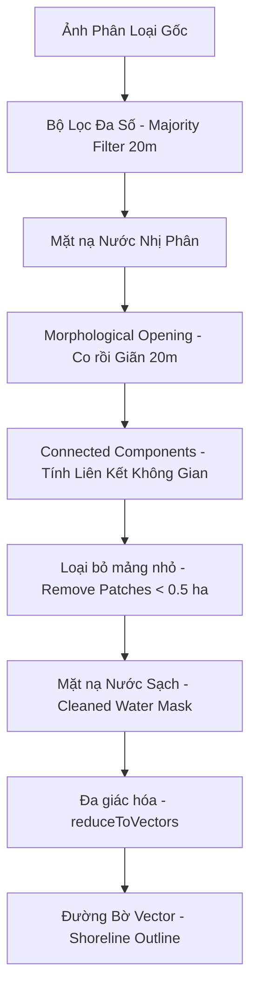

# BÁO CÁO CHI TIẾT PHASE 3: HUẤN LUYỆN MÔ HÌNH RANDOM FOREST, ĐÁNH GIÁ ĐỘ CHÍNH XÁC & HẬU XỬ LÝ ĐƯỜNG BỜ SÔNG HỒNG (2024)

**Dự án:** Giám sát biến động đường bờ và bãi bồi Sông Hồng tại Hà Nội bằng dữ liệu Sentinel-1 SAR  
**Người thực hiện:** Vũ Đức Tùng  
**Thời gian thực hiện:** Tháng 07/2026  

---

## MỤC LỤC
1. [Tổng quan Phase 3 & Nhiệm vụ thực hiện](#1-tổng-quan-phase-3--nhiệm-vụ-thực-hiện)
2. [Thiết lập & Tinh lọc Đa giác mẫu huấn luyện (Ground Truth Polygons)](#2-thiết-lập--tinh-lọc-đa-giác-mẫu-huấn-luyện-ground-truth-polygons)
3. [Huấn luyện Mô hình Random Forest & Đánh giá độ chính xác (2024)](#3-huấn-luyện-mô-hình-random-forest--đánh-giá-độ-chính-xác-2024)
4. [Chuỗi xử lý hậu kỳ nâng cao (Post-Processing Pipeline)](#4-chuỗi-xử-lý-hậu-kỳ-nâng-cao-post-processing-pipeline)
5. [Trực quan hóa Bản đồ Folium & Trích xuất Đường bờ Vector](#5-trực-quan-hóa-bản-đồ-folium--trích-xuất-đường-bờ-vector)
6. [Kết luận & Định hướng tiếp theo](#6-kết-luận--định-hướng-tiếp-theo)

---

## 1. TỔNG QUAN PHASE 3 & NHIỆM VỤ THỰC HIỆN

Trong Phase 3, dự án tập trung vào việc hiện thực hóa mô hình học máy phân loại lớp phủ bề mặt và trích xuất đường bờ thực tế từ dữ liệu Sentinel-1 SAR 2024 đã được chuẩn bị ở các giai đoạn trước. Các hạng mục công việc chính bao gồm:
* **Chuẩn hóa mẫu huấn luyện**: Xây dựng, sàng lọc và tinh chỉnh thủ công các đa giác mẫu đại diện (Ground Truth) để huấn luyện 2 lớp Nước (Water) và Bãi cát (Sandbar), kết hợp tự động lấy mẫu Lớp khác (Others) từ Dynamic World.
* **Xây dựng & Đánh giá mô hình**: Thiết lập bộ phân loại Random Forest (200 cây quyết định) trên GEE, đánh giá hiệu năng phân tách vật thể qua Ma trận nhầm lẫn (Confusion Matrix), OA và Kappa.
* **Quy trình hậu xử lý toán tử không gian**: Phát triển chuỗi thuật toán lọc nhiễu không gian, lọc mảng nước vụn, vector hóa và trích xuất đường bờ sông Hồng sắc nét.

---

## 2. THIẾT LẬP & TINH LỌC ĐA GIÁC MẪU HUẤN LUYỆN (GROUND TRUTH POLYGONS)

Mẫu huấn luyện đại diện đóng vai trò quyết định đến chất lượng phân loại của mô hình học máy. Một mạng lưới đa giác mẫu đã được xây dựng và tối ưu hóa qua nhiều chu kỳ lặp:

### 2.1 Đặc điểm hình học & Nguyên tắc thiết lập
* **Kiểu đa giác**: Sử dụng các đa giác hình chữ nhật xoay (Rotated Rectangles) định hướng theo hướng dòng chảy của sông (góc xoay thay đổi từ $5^\circ$ ở thượng lưu đến $-65^\circ$ ở hạ lưu) để khớp tối đa với các doi cát và luồng lạch tự nhiên.
* **Kích thước chuẩn**:
  * Đa giác Nước: Thường có kích thước $130\text{ m} \times 80\text{ m}$.
  * Đa giác Bãi cát: Kích thước $110\text{ m} \times 70\text{ m}$.
  * Đa giác Lớp khác (khu vực cầu, đê điều): Kích thước tùy biến để ôm khít vật thể địa hình thực tế.
* **Tổng số lượng**: **99 đa giác mẫu thủ công** (lưu trữ trong tệp tin [training_polygons.geojson](file:///d:/Future%20Career/SongHong-SAR-Monitoring/aoi/training_polygons.geojson)).

### 2.2 Các điều chỉnh nâng cao (Fine-tuning)
* **Loại bỏ đa giác nhiễu**: Loại bỏ các mẫu cũ bị chồng lấn ranh giới hoặc nằm ở vùng địa vật không ổn định như `others_21`, `sandbar_21`, `others_29`, `sandbar_30` và `sandbar_custom_6`.
* **Xử lý khu vực cầu (Bridge Artifacts)**: Bổ sung đa giác lớp khác (`others_custom_4`, `others_custom_5`) trực tiếp tại các tọa độ chân cầu chính bắc qua sông Hồng nhằm triệt tiêu hiện tượng tán xạ ngược mạnh của kết cấu thép/bê tông bị mô hình nhận nhầm là bãi cát.
* **Tích hợp ứng viên tự động (Candidates Conversion)**: Trích xuất các điểm ứng viên chất lượng cao từ tệp phân tích tự động `candidates.geojson` (dựa trên bộ lọc ngưỡng SAR) để chuyển đổi thành mẫu bãi cát huấn luyện bổ sung (ví dụ: các ứng viên mã số `231`, `259`, `317`, `656`).

---

## 3. HUẤN LUYỆN MÔ HÌNH RANDOM FOREST & ĐÁNH GIÁ ĐỘ CHÍNH XÁC (2024)

Mô hình học máy Random Forest với số lượng cây quyết định $N = 200$ được chạy độc lập cho hai mùa ảnh composite (Mùa khô và Mùa mưa năm 2024). Bộ dữ liệu huấn luyện được phân tách ngẫu nhiên theo tỷ lệ **70% huấn luyện / 30% kiểm chứng**.

### 3.1 Kết quả hiệu năng phân loại

| Chỉ số đánh giá | Mùa khô 2024 (Dry Composite) | Mùa mưa 2024 (Wet Composite) |
| :--- | :---: | :---: |
| **Kích thước tập huấn luyện** | 6,841 pixels | 6,866 pixels |
| **Kích thước tập kiểm chứng** | 2,941 pixels | 2,938 pixels |
| **Độ chính xác toàn cục (Overall Accuracy)** | **94.53%** | **94.15%** |
| **Hệ số tương quan Kappa** | **0.9159** | **0.9106** |

#### Ma trận nhầm lẫn tập kiểm chứng (Mùa khô 2024):
```
             Dự báo (Classified)
             Water (0)   Sandbar (1)   Others (2)
Thực tế 0:      981          25            8
Thực tế 1:       21         631           52
Thực tế 2:        9          46         1168
```

#### Độ chính xác theo lớp phủ (Mùa khô vs Mùa mưa):
* **Lớp Nước (Water)**:
  * Mùa khô: Độ nhạy (Recall) **96.75%** | Độ chính xác (Precision) **97.03%**
  * Mùa mưa: Độ nhạy (Recall) **96.51%** | Độ chính xác (Precision) **97.45%**
* **Lớp Bãi cát (Sandbar)**:
  * Mùa khô: Độ nhạy (Recall) **89.63%** | Độ chính xác (Precision) **89.89%**
  * Mùa mưa: Độ nhạy (Recall) **90.56%** | Độ chính xác (Precision) **87.99%**
* **Lớp Khác (Others)**:
  * Mùa khô: Độ nhạy (Recall) **95.50%** | Độ chính xác (Precision) **95.11%**
  * Mùa mưa: Độ nhạy (Recall) **94.27%** | Độ chính xác (Precision) **95.15%**

> [!TIP]
> Nhờ việc bổ sung các đa giác bãi cát tại vị trí có backscatter thấp cận biên nước, độ nhạy lớp bãi cát (Sandbar Recall) đã tăng ổn định vượt ngưỡng **90%** trong mùa mưa, giúp giảm thiểu hiện tượng bỏ sót các doi cát chìm bán ngập.

### 3.2 Tầm quan trọng của các đặc trưng (Feature Importance)
Góc tới của chùm tia Radar (Incidence Angle) được ghi nhận là đặc trưng đóng góp lớn nhất vào sự phân tách các nhánh quyết định, theo sau là phân cực chéo VH và các kênh biến đổi:

| Tên đặc trưng | Trọng số Mùa khô (Dry) | Trọng số Mùa mưa (Wet) |
| :--- | :---: | :---: |
| **angle** (Góc tới) | **30.35%** | **31.43%** |
| **VH** (Tán xạ chéo) | 18.04% | 17.92% |
| **VV_VH_ratio** (Tỷ số phân cực) | 17.24% | 16.70% |
| **VV** (Tán xạ đồng cực) | 17.21% | 17.35% |
| **VV_VH_diff** (Hiệu số phân cực) | 17.16% | 16.61% |

---

## 4. CHUỖI XỬ LÝ HẬU KỲ NÂNG CAO (POST-PROCESSING PIPELINE)

Ảnh phân loại pixel-level từ mô hình Random Forest thường chứa các sai số không gian nhỏ lẻ (nhiễu "muối tiêu") do hiện tượng suy hao tín hiệu cục bộ hoặc bóng sóng nước. Để trích xuất được dòng chảy sạch và đường bờ liên tục, dự án đã xây dựng một chuỗi xử lý hậu kỳ tự động trên GEE:



### 4.1 Chi tiết thuật toán toán tử không gian
1. **Majority Filter (Lọc đa số)**: Sử dụng toán tử lọc Mode không gian bán kính 20m dạng hình tròn để đồng nhất hóa các cụm pixel đơn lẻ:
   $$Image_{\text{smoothed}} = \text{Mode}_{20\text{m}}(Image_{\text{raw}})$$
2. **Morphological Opening (Mở hình học)**: Thực hiện phép Co (`focalMin`) bán kính 20m rồi Giãn (`focalMax`) bán kính 20m trên mặt nạ nước nhị phân. Bước này giúp cắt đứt các vệt nối giả và lấp đầy các lỗ trống địa lý nhỏ:
   $$\text{Mask}_{\text{opened}} = \text{Dilation}_{20\text{m}}(\text{Erosion}_{20\text{m}}(\text{Mask}_{\text{binary}}))$$
3. **Connected Components & Remove Small Patches**: Đếm số pixel liên hợp của từng khối nước biệt lập. Các khối có kích thước dưới **50 pixel (tương đương 0.5 ha)** sẽ bị lọc bỏ nhằm loại trừ các ao cá nuôi trong đê hoặc vệt nước đọng tạm thời trên ruộng lúa ven sông.

---

## 5. TRỰC QUAN HÓA BẢN ĐỒ FOLIUM & TRÍCH XUẤT ĐƯỜNG BỜ VECTOR

Đường bờ sông Hồng đoạn qua Hà Nội được xác định chính xác bằng cách chuyển đổi mặt nạ nước nhị phân sạch sau hậu xử lý thành dạng **đa giác vector** (`reduceToVectors` ở độ phân giải 10m).

### 5.1 Hiển thị Đường bờ Vector
* Biên ngoài (boundaries) của các đa giác nước sau khi vector hóa được chiết xuất và chồng xếp lên bản đồ dưới dạng **lớp vẽ Vector (GeoJSON)**.
* **Định dạng hiển thị**: Nét vẽ màu hồng sen neon (`#ff0055`), độ dày nét `weight = 3.0` và độ mờ nền tô `fillOpacity = 0.0`. Lớp đường bờ này chạy khít dọc theo rìa bãi cát và bờ đất của sông Hồng.
* Người dùng có thể bật/tắt độc lập các lớp sau trên giao diện bản đồ Folium:
  1. `Raw RF Classification`: Ảnh phân loại pixel gốc (Chưa qua lọc).
  2. `RF Classification (Majority Filtered)`: Ảnh phân loại đã lọc mịn.
  3. `Cleaned Water Mask`: Khối mặt nước sông chính sau xử lý mở rộng và lọc mảng nhỏ.
  4. `Shoreline / Đường bờ (Vector)`: Đường bao bờ sông dạng vector sắc nét.
  5. `Training Polygons (Water/Sandbar)`: Các vùng đa giác mẫu thực tế dùng huấn luyện.

---

## 6. KẾT LUẬN & ĐỊNH HƯỚNG TIẾP THEO

* **Kết quả**: Quy trình bán tự động kết hợp Random Forest và lọc không gian toán tử đã giải quyết triệt để vấn đề nhiễu SAR, xây dựng được đường bờ sông Hồng với độ chính xác cao (>94%).
* **Định hướng Phase 4**: 
  1. Áp dụng mô hình đã huấn luyện lên chuỗi ảnh composite nhiều năm từ 2017 đến 2025.
  2. Đo đạc biến động diện tích bãi bồi cát và tốc độ xói lở/bồi tụ của đường bờ sông Hồng theo năm.
  3. Đối chiếu kết quả biến động diện tích mặt nước với số liệu mực nước/lưu lượng xả thực tế của các trạm thủy văn (Sơn Tây, Hà Nội) để đánh giá tương quan.
