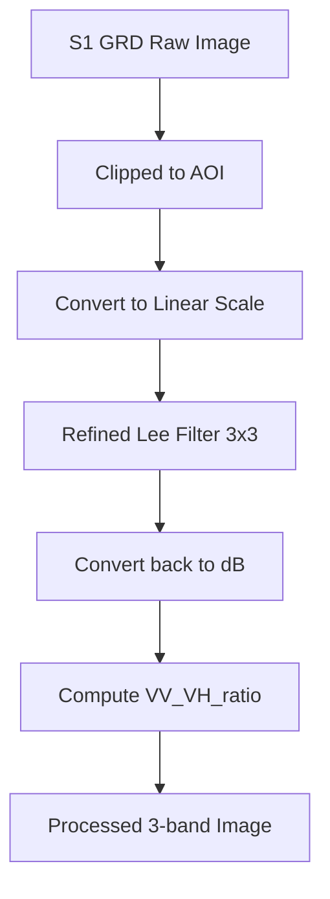

# Ghi chú Kỹ thuật — Tuần 1: Chuẩn bị dữ liệu & Tiền xử lý SAR

Dưới đây là các thông số kỹ thuật, giá trị tham chiếu và phân tích kết quả cho giai đoạn chuẩn bị dữ liệu vệ tinh Sentinel-1 (SAR) giám sát sông Hồng đoạn qua Hà Nội.

---

## 1. Thông số kỹ thuật Sentinel-1 GRD

Dữ liệu được sử dụng là **Sentinel-1 Ground Range Detected (GRD)** với các đặc tính sau:
- **Sensor:** C-band Synthetic Aperture Radar (SAR)
- **Mode:** Interferometric Wide Swath (IW)
- **Orbit Pass:** Descending (Quỹ đạo đi xuống) để đảm bảo góc chiếu đồng nhất
- **Polarizations:** VV và VH (Dual-polarization)
- **Độ phân giải không gian:** 10m (native spacing)
- **Hệ tọa độ xuất ra:** WGS 84 / UTM Zone 48N (`EPSG:32648`)

---

## 2. Tiền xử lý dữ liệu (Preprocessing Pipeline)

Quy trình xử lý được lập trình mô-đun hóa trong `src/preprocessing.py`, bao gồm các bước:

### 2.1 Bộ lọc Speckle (Refined Lee Filter)
- Để giảm nhiễu "muối tiêu" (speckle noise) đặc trưng của ảnh SAR, bộ lọc **Refined Lee Filter (3x3 square kernel)** được áp dụng.
- **Nguyên lý:** Bộ lọc chuyển đổi giá trị ảnh từ dB sang Linear scale, tính toán giá trị trung bình cục bộ (local mean) và phương sai (local variance) trong cửa sổ lọc, tính trọng số Lee (Lee weight) dựa trên ENL (Equivalent Number of Looks ~ 4.9 cho IW mode), thực hiện làm mịn có điều kiện, sau đó chuyển ngược lại thang dB.
- **Ép kiểu an toàn (Safe Casting):** Kết quả được ép kiểu `ee.Image` rõ ràng để tương thích với Python GEE API, tránh lỗi generic `Element`.

### 2.2 Đặc trưng SAR trích xuất
1. **VV (dB):** Phản xạ ngược phân cực dọc-dọc. Nhạy cảm với cấu trúc mặt nước (cho giá trị phản xạ cực thấp do phản xạ gương).
2. **VH (dB):** Phản xạ ngược phân cực dọc-ngang. Nhạy cảm với thảm thực vật và độ nhám đất.
3. **VV/VH Ratio (dB):** Tính toán bằng `VV(dB) - VH(dB)`. Đây là đặc trưng quan quan trọng hỗ trợ phân tách ranh giới nước-đất và bãi cát giữa sông.

---

## 3. Thống kê dữ liệu & Kiểm tra Gap (2015–2024)

Tổng số lượng ảnh Sentinel-1 thu thập được trong AOI là **317 ảnh**.
Phân phối ảnh theo năm cực kỳ ổn định (trung bình ~30 ảnh/năm, khoảng 12 ngày/chu kỳ lặp):

| Năm | Số lượng ảnh | Trạng thái |
|---|---|---|
| 2015 | 37 | ✅ OK |
| 2016 | 37 | ✅ OK |
| 2017 | 29 | ✅ OK |
| 2018 | 31 | ✅ OK |
| 2019 | 29 | ✅ OK |
| 2020 | 34 | ✅ OK |
| 2021 | 29 | ✅ OK |
| 2022 | 30 | ✅ OK |
| 2023 | 30 | ✅ OK |
| 2024 | 31 | ✅ OK |

> [!NOTE]
> Không phát hiện bất kỳ khoảng trống dữ liệu (gap) lớn nào. Bộ dữ liệu đủ độ dày thời gian cho việc phân tích biến động chuỗi 10 năm.

---

## 4. Kiểm chứng Tự động giá trị Backscatter (Validation Results)

Chất lượng tiền xử lý và lọc nhiễu speckle được kiểm chứng tự động thông qua hàm `verify_backscatter_values` tại hai điểm tham chiếu đại diện bên trong AOI trên ảnh Composite tháng 1/2024:

- **Điểm nước (Water Point - [105.8600, 20.9500]):**
  - Trị số VV thực tế: **-18.70 dB** (Đạt chuẩn nước lý thuyết: < -15 dB)
  - Trị số VH thực tế: **-23.32 dB**
  - Trị số Ratio thực tế: **4.72 dB**
  - Trạng thái kiểm chứng: **PASSED** ✅
- **Điểm đất (Land Point - [105.8600, 21.0100]):**
  - Trị số VV thực tế: **-1.54 dB** (Đạt chuẩn đất lý thuyết: > -10 dB)
  - Trị số VH thực tế: **-7.47 dB**
  - Trị số Ratio thực tế: **5.92 dB**
  - Trạng thái kiểm chứng: **PASSED** ✅

---

## 5. Xuất dữ liệu mẫu (GEE Export Tasks)

Đã gửi thành công 3 task xuất ảnh composite định dạng GeoTIFF (độ phân giải 10m, hệ tọa độ UTM Zone 48N) lên GEE Server để phục vụ kiểm tra ngoài GEE:
1. `SongHong_S1_Composite_2020_01_dry` (Composite mùa khô)
2. `SongHong_S1_Composite_2020_08_wet` (Composite mùa lũ)
3. `SongHong_S1_Annual_2024` (Composite cả năm 2024)
