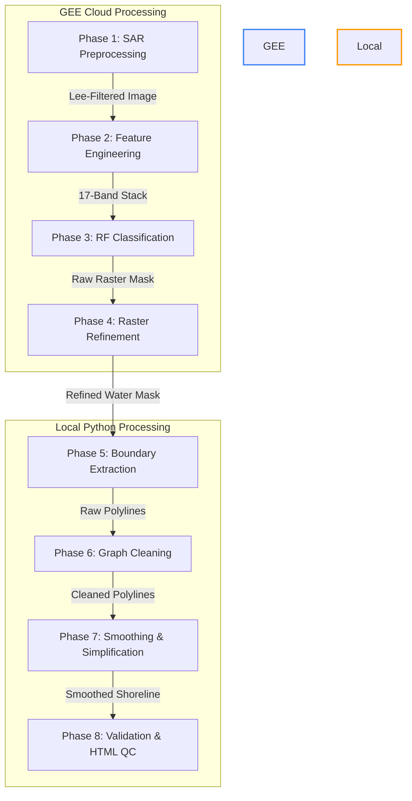

# Project Summary Report: SongHong SAR Monitoring 🛰️

> **Giám sát biến động đường bờ và bãi bồi Sông Hồng tại Hà Nội bằng dữ liệu Sentinel-1 SAR**
>
> *An end-to-end, publication-grade, semi-automated pipeline for monitoring river dynamics and shoreline migration under seasonal discharge variations.*

---

## 1. Project Overview & Objectives

The **SongHong SAR Monitoring** project was developed to establish a robust, repeatable workflow on **Google Earth Engine (GEE)** and **local Python** for monitoring water surface, active riverbed channels, and sandbar (bãi bồi) morphodynamics.
* **Study Area**: An 80 km active corridor of the Red River (Sông Hồng) passing through Hanoi (from Sơn Tây to Phú Xuyên), covering a total Area of Interest (AOI) of **362.83 km²**.
* **Temporal Scope**: A 10-year period from **2017 to 2026** using descending-orbit Sentinel-1 Synthetic Aperture Radar (SAR) imagery.
* **Context**: Developed during a research initiative / internship at the **Vietnam Space Center (VNSC)** (June – August 2026) under the evaluation of Ông Vũ Anh Tuân.
* **Core Output**: High-resolution, topology-preserving seasonal shorelines (dry vs. wet seasons) extracted using a machine-learning-based, topologically-constrained boundary extraction pipeline.

---

## 2. Modular Pipeline Architecture

The workflow is structured into 8 sequential phases, partitioning heavy raster classification on GEE and vector processing locally in Python.

### Phase 1: SAR Preprocessing (GEE)
* **Data Selection**: Restricts inputs to descending orbit passes to eliminate directional terrain shadow and look-angle bias.
* **Noise Suppression**: Removes thermal and orbital border noise.
* **Calibration & Orthorectification**: Radiometrically calibrates raw pixel values to backscatter $\sigma^0$ (Sigma0) and orthorectifies using the GEE DEM.
* **Speckle Filtering**: Uses an adaptive **Refined Lee filter (7x7)** in the linear power domain to reduce speckle while maintaining sharp bank and sandbar edges.

### Phase 2: Feature Engineering (GEE)
* Generates a **17-band stack** for the Random Forest classifier:
  * **Raw Polarizations**: $VV$, $VH$
  * **Polarization Ratios**: Ratio ($VV_{\text{dB}} - VH_{\text{dB}}$), Sum ($VV + VH$), and Mean
  * **Texture Metrics**: 6 GLCM features (Contrast, Entropy, Homogeneity, Correlation, ASM, Variance) computed over $5\times5$ windows to separate rough vegetative sandbars from smooth water surfaces.

### Phase 3: Random Forest Classification (GEE)
* Employs a **Random Forest classifier** (300 trees, 3 split variables) trained on a balanced, stratified dataset.
* Classifies imagery into 4 classes: *Water (1)*, *Sand (2)*, *Built-up (3)*, and *Vegetation (4)*.

### Phase 4: Raster Calibration & Refinement (GEE)
* **Dynamic Calibration**: Calibrates VV/VH thresholds against Sentinel-2 optical reference shorelines to account for seasonal variations.
* **Morphological Cleaning**: Applies morphological opening ($R=20$m) and closing ($R=30$m) with disk structural elements to remove salt-and-pepper classification noise.
* **Active Corridor Selection**: Filters connected water components to keep only the active Red River channel.

### Phase 5: Boundary Extraction (Local Python)
* Vectorizes water and sand mask polygons.
* Extracts the physical contact boundary between the main water channel and sandbars: 
  $$\text{Shoreline} = \partial(\text{Water}) \cap \partial(\text{Sand})$$
* This isolates the active shoreline, excluding dry land boundaries and city embankments.

### Phase 6: Graph-Based Topo Cleaning (Local Python)
* Constructs a spatial network graph from extracted polylines.
* Prunes short dangling spurs and snaps disconnected segment endpoints to ensure continuous bank lines.

### Phase 7: Curve Smoothing & Simplification (Local Python)
* Applies **Chaikin's corner-cutting algorithm** (3 iterations) to eliminate pixelated staircase geometry.
* Applies **Douglas-Peucker simplification** (1.0m tolerance) to reduce vertex density by ~74% while maintaining strict spatial fidelity.

### Phase 8: Positional Validation (Local Python)
* Performs a KD-Tree nearest-neighbor search comparing the Sentinel-1 SAR-extracted shoreline with an independent Sentinel-2 NDWI optical reference shoreline.
* Computes positional error metrics (RMSE, Mean, Max/Hausdorff, and buffer-based agreement percentages).

---

## 3. Key Technical Innovations

### 🌉 A. Centerline-Connector Bridge Exclusion Method
Standard morphological closing fails to bridge the water mask under major bridges (e.g., Nhật Tân, Thăng Long) because radar shadows and double-bounce scatter create wide gaps ($>180$m). If a large global closing radius is used, it spills onto land.
* **Solution**: The pipeline intersects the continuous river centerline with digitized bridge polygons (`data/bridges.geojson`). These segment intersections are buffered by 50m to create capsule connectors inside the channel. Unioning these with the water mask cleanly bridges the gaps under bridge decks, preventing the shorelines from wrapping around structures.

### 🏝️ B. Multi-Criteria Island Filtering
Speckle noise and aquaculture ponds near the banks can mimic island shapes. The pipeline filters out false islands using two metrics:
1. **Circularity**: $\text{Circularity} = \frac{4\pi \cdot \text{Area}}{\text{Perimeter}^2}$. Features with circularity $\ge 0.8$ are pruned as artificial/circular ponds.
2. **S2 Water Overlap**: If a candidate island overlaps with the Sentinel-2 NDWI water mask by $\ge 50\%$, it is identified as a temporarily submerged sandbar or radar reflection noise and is pruned.

### 🔄 C. Active Learning Hotspot Bootstrapping
To correct persistent spatial errors, the script `scripts/expand_training_polys.py` automatically detects validation outliers (distance error $\ge 100$m), pulls Sentinel-2 spectral indices over those locations, auto-labels the pixels, and appends them as new training samples to the dataset.

---

## 4. Quantitative Validation Results (2024 Baseline)

After incorporating the centerline-connector bridge exclusion method, the validation metrics against the Sentinel-2 NDWI reference shorelines show significant accuracy improvements, particularly in the Wet season:

### A. Distance Error Distributions

| Metric | 2024 Dry Season | 2024 Wet Season |
| :--- | :---: | :---: |
| **Minimum Error** | 0.02 m | 0.05 m |
| **Mean Error** | 41.63 m | 28.73 m |
| **Median (P50) Error** | 11.60 m | 16.08 m |
| **RMSE** | **113.70 m** | **51.27 m** |
| **Hausdorff Distance (Max)** | **1162.34 m** | **516.18 m** |
| **95th Percentile (P95)** | **180.66 m** | **108.74 m** |

### B. Buffer-Based Spatial Agreement (%)
Measures the percentage of extracted SAR shoreline length falling within a specified buffer of the optical reference:

| Buffer Width (m) | 2024 Dry Season Coverage | 2024 Wet Season Coverage |
| :---: | :---: | :---: |
| **&le; 10 m** | 40.17% | 31.93% |
| **&le; 20 m** | 66.64% | 58.25% |
| **&le; 30 m** | 77.02% | 73.65% |
| **&le; 50 m** | **86.14%** | **86.60%** |
| **&le; 100 m** | **91.77%** | **94.34%** |

---

## 5. Reach-Based Validation Metrics (Phân tích theo Phân đoạn sông)

To analyze spatial variations in extraction accuracy, the 80 km river corridor was partitioned into three reaches of equal length along the centerline flow distance:
* **Reach 1 (Upper Reach - Thượng lưu)**: Confluence zone near Sơn Tây / Ba Vì (km 0 to km 57.28). Characterized by wide, highly dynamic sandbars, multiple bifurcated active channels, and shallow waters.
* **Reach 2 (Middle Reach - Trung lưu)**: Urban Hanoi corridor (km 57.28 to km 114.56). Characterized by high embankment constraints, bridge crossings, and relatively stable channels.
* **Reach 3 (Lower Reach - Hạ lưu)**: Meandering agricultural plain near Phú Xuyên (km 114.56 to km 171.84). Characterized by gentle slopes, extensive agricultural floodplains, and meandering banks.

### A. 2024 Dry Season Reach-Based Accuracy
| Reach | Resampled Points | Mean Error (m) | Median Error (m) | RMSE (m) | Hausdorff (m) | P95 (m) |
| :--- | :---: | :---: | :---: | :---: | :---: | :---: |
| **Reach 1 (Upper)** | 22,503 | 80.15 | 17.73 | 178.87 | 1162.34 | 440.97 |
| **Reach 2 (Middle)** | 14,776 | 22.79 | 12.52 | 37.58 | 198.47 | 90.96 |
| **Reach 3 (Lower)** | 20,558 | **13.01** | **10.03** | **18.30** | **175.04** | **35.41** |

### B. 2024 Wet Season Reach-Based Accuracy
| Reach | Resampled Points | Mean Error (m) | Median Error (m) | RMSE (m) | Hausdorff (m) | P95 (m) |
| :--- | :---: | :---: | :---: | :---: | :---: | :---: |
| **Reach 1 (Upper)** | 22,709 | 34.27 | 16.44 | 63.22 | 516.18 | 135.33 |
| **Reach 2 (Middle)** | 15,689 | 31.98 | 19.99 | 52.79 | 376.63 | 116.91 |
| **Reach 3 (Lower)** | 20,558 | **20.13** | **11.90** | **31.59** | **217.54** | **61.22** |

### C. Scientific Reach-Based Interpretations:
1. **High Accuracy in Lower/Middle Reaches**: Reaches 2 and 3 exhibit exceptionally low median errors (~10m to ~12m) and small RMSEs (18.30m in Reach 3 Dry). This demonstrates that the pipeline is highly precise in stable, embanked, or gently meandering river corridors.
2. **Outlier Concentration in Reach 1 (Upper)**: The upper reach contains the highest error values (e.g., dry season Hausdorff = 1162.34m, RMSE = 178.87m). This is physically driven by the extreme width of the active river bed and the existence of highly dynamic, low-relief sandbars. These sandbars shift significantly between Sentinel-1 and Sentinel-2 acquisition times and contain seasonal shallow-water channels that can be classified differently due to wet/dry soil moisture variation.

---

## 6. Main Findings & Scientific Interpretations

1. **Seasonal Morphological Agreement**:
   - The **Dry Season** exhibits a very low median error (**11.60 m**), indicating that exposed sandbars and stable river flow paths are highly consistent between optical and radar sensors.
   - The **Wet Season** achieves a mean error of **28.73 m** and an RMSE of **51.27 m** (a major improvement from 76.71m prior to bridge exclusion).
2. **Outlier Attribution**:
   - Outliers ($\ge 100$m) occur in highly dynamic sandbar zones where geometries shift between Sentinel-1 and Sentinel-2 acquisition dates, and on vegetated floodplains where radar backscatter and optical spectral response react differently to water-vegetation mixtures.
3. **Bridge-Tracing Elimination**:
   - Checking final geometries confirmed that the shorelines only intersect bridge decks width-wise (~60m wide), verifying that the centerline-connector method successfully prevented the shoreline from tracing along the lengths of the bridges.

---

## 💻 Tech Stack
* **Cloud Platform**: Google Earth Engine (GEE)
* **Libraries**: Python 3.10, GeoPandas, Shapely, NetworkX, Rasterio, SciPy, NumPy, pandas, Folium, geemap
* **Orchestration**: Python scripts (`scripts/`) & Jupyter Notebooks (`week1_pipeline.ipynb`, `week2_pipeline.ipynb`)
