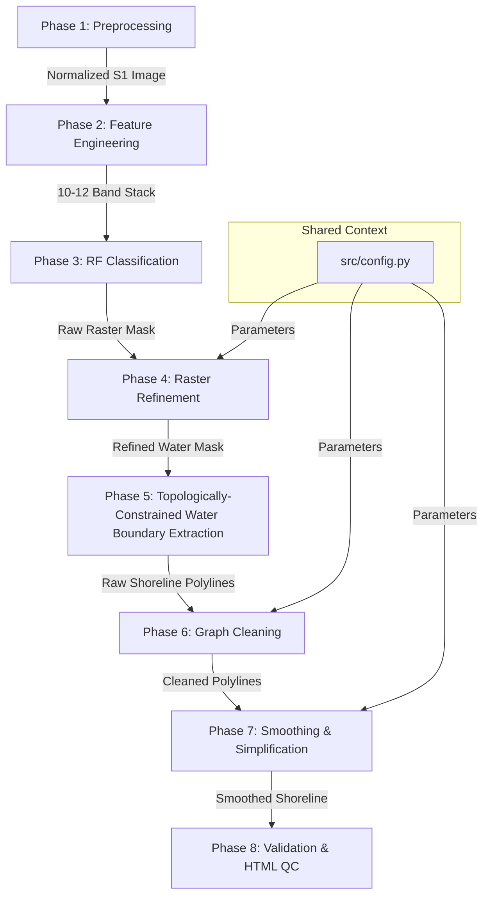

# Master Agent Blueprint - Shoreline Extraction Pipeline

**Methodology Version**: 1.0 (Locked - Do not modify)

This document coordinates the implementation of the entire publication-grade shoreline extraction pipeline. It defines how individual phases integrate, how data is passed between phases, and how orchestration scripts should be constructed.

---

## 1. Global Pipeline Architecture

The pipeline consists of 8 sequential phases. Their primary execution platforms are defined as:
* **Phase 1–4**: Primary execution is on **Google Earth Engine (GEE)**. Optional local Python processing is only used when GEE lacks the required functionality.
* **Phase 5–8**: Primary execution is in **local Python** (using libraries like GeoPandas, Shapely, NetworkX, and Folium). GEE is used only for visualization or data access if necessary.

---

## 2. Shared Data Contracts

To ensure compatibility between phases, the following data specifications are enforced:

### A. Spatial Reference System & Resolution
* **Coordinate Reference System (CRS)**: `EPSG:32648` (WGS 84 / UTM Zone 48N) for local spatial operations (distance, area).
* **GEE Projection**: Native Sentinel-1 resolution of `10 meters` (`scale=10`).

### B. Class Schema
* **4-Class Classification Schema (Phase 3 & 4)**:
  * `1`: Water
  * `2`: Sand
  * `3`: Built-up
  * `4`: Vegetation
* **Binary Refinement Masks (Phase 4 & 5)**:
  * **Water Mask**: Binary raster where $1 = \text{Water}$ (Class 1) and $0 = \text{All others}$.
  * **Sand Mask**: Binary raster where $1 = \text{Sand}$ (Class 2) and $0 = \text{All others}$ (used strictly for bank attributes and statistics).

### C. Vector Data Contracts
* **Shoreline Boundary Output**: GeoJSON or `ee.FeatureCollection` of `LineString` elements representing the exterior and island boundaries of the main river water body.
* **Smoothed Shoreline Output**: A clean, simplified, topology-preserving set of LineString segments representing the final bank and island shorelines.

---

## 3. Implementation Checklist for Coordinating Agents

When implementing the pipeline, agents must construct the following core files in order:

### 1. Module Files
* [x] **`src/classification.py`**:
  * Implements Phase 2 (GLCM calculation, Feature stack compilation).
  * Implements Phase 3 (Random Forest model training and classification).
* [x] **`src/shoreline.py`**:
  * Implements Phase 4 (raster morphological opening/closing with disk kernels, connected component isolation).
  * Implements Phase 5 (polygonization & centerline-constrained water boundary extraction).
  * Implements Phase 6 (network graph cleaning: duplicate removal, linemerge, snap, prune, merge again, length filter).
  * Implements Phase 7 (Chaikin's corner-cutting and Douglas-Peucker simplification preserving topology).
* [x] **`src/preprocessing.py`**:
  * Houses the Refined Lee filter and border-noise removal routines (already completed).

### 2. Orchestration Scripts
* [x] **`scripts/train_classifier.py`**:
  * Coordinates training sample extraction.
  * Trains the RF classifier using 2024 Dry/Wet composites as the calibration baseline.
  * Evaluates accuracy (Precision, Recall, F1 for Sand) and saves/exports the trained classifier object.
* [x] **`scripts/extract_research_shoreline.py`**:
  * Loads the trained classifier.
  * Executes the entire extraction pipeline (Phases 1-8) for a specified year or composite.
  * Calibrates S1 classification using reference S2 NDWI shorelines.
  * Generates the final metrics and exports the interactive HTML QC maps.

---

## 4. Pipeline Refinement Upgrades (Added 2026)
* **Manual Bridge Masking**: Decoupled from the Overpass API to avoid rate limits and connection issues. Implemented a local workflow using a Leaflet-based custom tool (`tools/digitize_bridges.html`) to draw and output bridge polygons to `data/bridges.geojson`, which are loaded locally to mask out false river-crossing structures.
* **Multi-Criteria Island Filtering**: Resolves false-positive island features (e.g. fish ponds, specular noise) by checking:
  1. *Circularity*: $\text{Circularity} = (4 \pi \times \text{Area}) / \text{Perimeter}^2$. If $\ge 0.8$, the feature is flagged as a circular pond and removed.
  2. *S2 NDWI Overlap*: If the overlap between the candidate island and the S2 water mask is $\ge 50\%$, it indicates the island is actually under water in optical composites and represents SAR specular reflection noise, so it is removed.
* **Active Learning Hotspot Bootstrapping**: Automated training polygon expansion script (`scripts/expand_training_polys.py`) identifies validation outliers (distance error $\ge 100\text{ m}$), queries cloud-free Sentinel-2 NDWI/NDVI/NDBI spectral indices over these locations, auto-classifies them, and appends them as new training samples to `aoi/training_polygons.geojson`.

---

## 5. Definition of Done (DoD)

Before any phase is considered finished and ready for the next stage, the executing agent must verify the following:
- [x] **All functions implemented**: All modules required for the current phase are coded, documented with detailed docstrings, and strictly adhere to approved math/logic.
- [x] **No runtime errors**: Code compiles and executes without warnings, exceptions, or memory allocation errors.
- [x] **HTML generated**: Interactive visualization map is exported for the current phase containing:
  * LayerControl
  * Legend
  * Scale Bar
  * North Arrow
  * Coordinate popup
- [x] **Checkpoint PASS**: Quantitative metrics (e.g., target F1-score $\ge 75\%$, component count reduction $\ge 95\%$, Hausdorff distance $\approx 10\text{ m}$) are successfully logged and meet the criteria.
- [x] **Checkpoint Failure Policy Applied**: If any checkpoint metric fails, execution **must stop** and write a failure report. Do not continue.
- [x] **Report/Logs written**: Execution parameters, times, warnings, and errors are documented.
- [x] **Ready for next phase**: Outputs match the input contracts of the subsequent phase.
